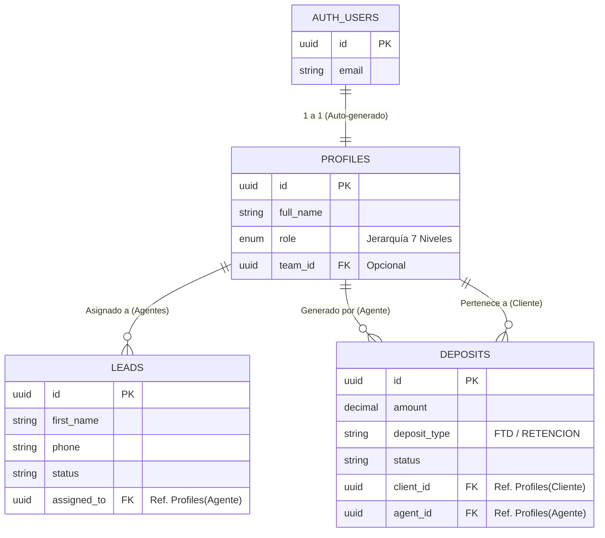

# 06. Arquitectura de Base de Datos (Supabase)

Este documento detalla el modelo de persistencia de datos implementado en PostgreSQL a través de Supabase para la plataforma **InvesPro**.

## 1. Topología General

InvesPro utiliza una base de datos relacional orientada a eventos, diseñada específicamente para soportar la jerarquía corporativa de un Floor de Ventas Institucional, además de mantener estrictos controles de seguridad mediante Row Level Security (RLS).

### Modelo Entidad-Relación Básico

## 2. Jerarquía de Roles (RBAC Nivel Base de Datos)

Se implementó el tipo `ENUM` nativo en PostgreSQL para garantizar consistencia:
- `CLIENT`: El inversor final.
- `AGENT`: Mano de obra operativa (Llamadas y cierres).
- `TEAM_LEADER` / `FLOOR_MANAGER`: Gestión de mesas de agentes.
- `MANAGER` / `CHIEF` / `HEAD`: Alta Dirección (Auditorías y Reportes).

## 3. Tablas Core

### 3.1 `profiles`
Tabla pública que extiende la tabla privada `auth.users` de Supabase.
- Contiene los roles y nombres públicos.
- **Trigger Automático:** Cuando un usuario se registra mediante Supabase Auth, una función (Trigger) inyecta inmediatamente una fila aquí para que asuma un rol (por defecto `CLIENT`).

### 3.2 `leads`
Base de datos del CRM utilizada por los agentes.
- Controla el embudo de ventas (`status`: Nuevo, Contactado, etc.).
- Tiene Foreign Keys apuntando al `id` del Agente asignado.

### 3.3 `deposits`
Tabla transaccional para auditar el flujo de caja.
- Crucial para que el *Chief* y el *Head* midan las conversiones (FTD) y los upsells (Retención).
- Contiene dos referencias críticas: Quién depositó (`client_id`) y qué agente concretó la venta (`agent_id`).

## 4. Políticas de Seguridad RLS (Row Level Security)

Para garantizar la confidencialidad, la lógica de acceso está bloqueada a nivel de kernel de base de datos, no solo en el Frontend:

| Tabla | Rol | Política RLS (Acceso Permitido) |
|---|---|---|
| **Profiles** | Cualquiera | Solo puede ver su propio perfil (`auth.uid() = id`). |
| **Profiles** | Alta Dirección | Pueden ver la lista completa de todos los empleados y clientes de la empresa. |
| **Leads** | Agente | Solo puede consultar filas donde `assigned_to` sea su propio UUID. ¡Imposible robar leads de otra mesa! |
| **Leads** | Alta Dirección | Acceso de lectura y escritura a toda la base para inyectar/reasignar clientes. |
| **Deposits**| Agente | Ve solo sus comisiones/ventas cerradas. |

## 5. Script de Inicialización

El código completo DDL para instanciar esta arquitectura está disponible en el archivo `/supabase/schema.sql`. Este archivo debe ejecutarse directamente en el SQL Editor de la consola de Supabase.
