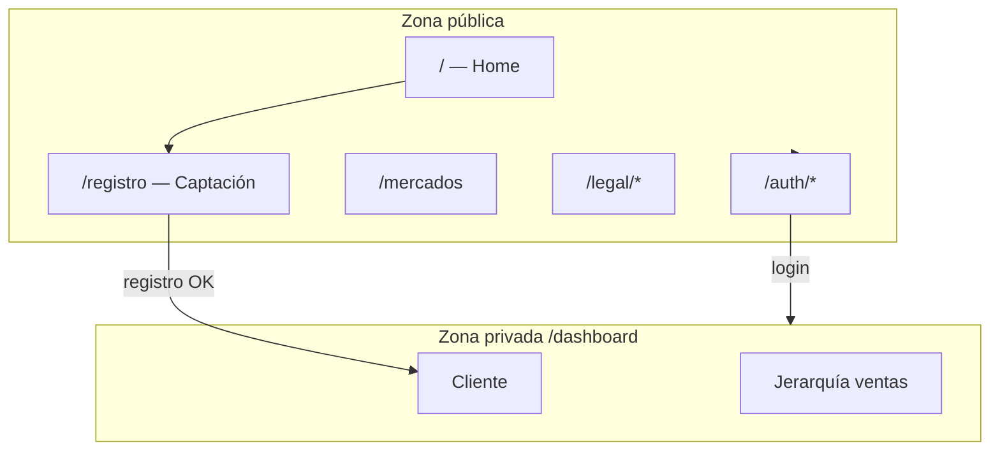
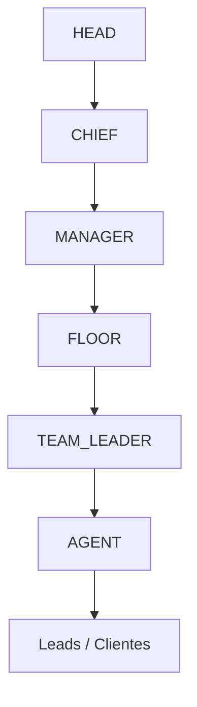
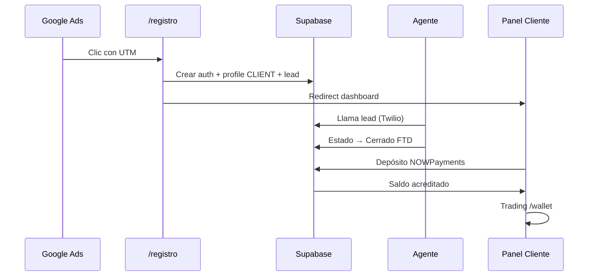

# 19 — Guía de Funcionamiento del Sistema InvestPRO

> Documento orientado a **negocio, operaciones y onboarding**: qué es cada pantalla, quién la usa y cómo se conecta con el resto de la plataforma.
> Para detalle técnico de roles y permisos ver [`08_ROLES_Y_FUNCIONES.md`](08_ROLES_Y_FUNCIONES.md). Para base de datos ver [`06_DATABASE_ARCHITECTURE.md`](06_DATABASE_ARCHITECTURE.md).

---

## 1. ¿Qué es InvestPRO?

**InvestPRO** es una plataforma web de broker / trading con dos mundos en uno:

| Mundo | Usuarios | Objetivo |
|:---|:---|:---|
| **Público (marketing)** | Visitantes, leads | Conocer el producto, registrarse, ver mercados |
| **Privado (dashboard)** | Clientes y equipo de ventas | Operar, depositar, llamar leads, auditar |

**Stack resumido:** React + Vite (frontend), Supabase (auth, base de datos, archivos), Binance WebSocket (precios crypto), Twilio (llamadas VoIP), NOWPayments (depósitos crypto).



---

## 2. Mapa de rutas (todas las pantallas)

### 2.1 Zona pública — sin iniciar sesión

| Ruta | Pantalla | ¿Para qué sirve? |
|:---|:---|:---|
| `/` | **Home / Landing principal** | Presentación de marca: hero, beneficios, herramientas, oferta. Barra de precios en vivo (TickerTape). Enlaces a registro y login. |
| `/registro` | **Landing de captación** | Página de conversión (estilo campaña Google Ads): formulario en 2 pasos (datos personales → contraseña + T&C). Crea cuenta **CLIENT** y redirige al panel. |
| `/mercados` | **Mercados** | Vista pública de instrumentos y precios (referencia comercial). Disclaimer de riesgo visible. |
| `/legal/terminos` | **Términos y Condiciones** | Texto legal público (requerido por ads y compliance). |
| `/legal/privacidad` | **Política de privacidad** | Tratamiento de datos (Ley 1581 Colombia, proveedores, ARCO). |
| `/legal/riesgos` | **Advertencia de riesgo** | Divulgación CFDs, apalancamiento, sin asesoría personalizada. |
| `/auth/login` | **Inicio de sesión** | Email + contraseña (Supabase Auth). Modo demo por rol para pruebas internas. |
| `/auth/recuperar` | **Recuperar contraseña** | Envía enlace de reset por correo. |
| `/auth/restablecer` | **Nueva contraseña** | Formulario tras el enlace del correo. |

### 2.2 Zona privada — requiere login (`/dashboard`)

Al entrar a `/dashboard`, el sistema **redirige automáticamente** al home del rol del usuario (`RoleRedirect` en `MainLayout`).

| Ruta | Rol principal | Pantalla |
|:---|:---|:---|
| `/dashboard/trade` | CLIENT | Terminal Fortrade (watchlist, gráfico, operaciones) |
| `/dashboard/account` | CLIENT | Cuenta, depósitos, KYC |
| `/dashboard/client?tab=*` | CLIENT | Legacy → `/dashboard/account?tab=*` |
| `/dashboard/trading` | CLIENT | Redirige a `/dashboard/trade` |
| `/dashboard/supervisor-market` | HEAD, CHIEF | Exposición mercado clientes (lectura) |
| `/dashboard/wallet` | CLIENT | Redirige a `/dashboard/account?tab=depositar` |
| `/dashboard/legal` | CLIENT | Hub legal interno |
| `/dashboard/advisor` | ADVISOR* | Retención / cartera (*ruta existe; rol en store es de los 7 institucionales) |
| `/dashboard/agent` | AGENT | Estación de ventas |
| `/dashboard/team-leader` | TEAM_LEADER | Líder de mesa |
| `/dashboard/floor` | FLOOR_MANAGER | Comandante de piso |
| `/dashboard/manager` | MANAGER | Dirección de ventas |
| `/dashboard/chief` | CHIEF | Operaciones ejecutivas |
| `/dashboard/head` | HEAD | Control total |

---

## 3. Zona pública — detalle por pantalla

### 3.1 Home (`/`)

**Componentes principales:**

| Bloque | Qué hace |
|:---|:---|
| **Navbar** | Logo, enlaces (Mercados, Registro, Login). |
| **TickerTape** | Precios crypto en scroll continuo (datos en vivo). |
| **HeroSection** | Mensaje principal y CTA hacia registro. |
| **BenefitsSection** | Ventajas del producto (seguridad, velocidad, soporte). |
| **AdvancedToolsSection** | Herramientas de trading destacadas. |
| **WhatWeOfferSection** | Instrumentos (crypto, forex, acciones, materias primas). |
| **Footer** | Enlaces legales y contacto. |
| **RiskDisclaimer** | Aviso fijo de riesgo financiero. |

**Flujo típico:** visitante → lee → va a `/registro` o `/auth/login`.

---

### 3.2 Registro / Captación (`/registro`)

Landing **dedicada a conversión** (campañas de pago). No es la misma que el home.

**Paso 1 — Identidad**

| Campo | Descripción |
|:---|:---|
| Nombre / Apellido | Validación mínima 2 letras. |
| Correo | Formato email válido. |
| Teléfono | Selector de país (`+57`, `+52`, …) + número local solo dígitos (Colombia: 10 dígitos). |

**Paso 2 — Acceso**

| Campo | Descripción |
|:---|:---|
| Contraseña | Mínimo 8 caracteres. |
| Confirmar contraseña | Debe coincidir. |
| Checkbox T&C | Obligatorio para continuar. |

**Al completar:** se crea usuario en Supabase Auth + perfil `CLIENT` + lead en CRM (si aplica). Mensaje de éxito → redirección a `/dashboard/account?tab=resumen` (~2,5 s).

**UTM:** lee `utm_source`, `utm_campaign`, etc. de la URL y guarda interés (Crypto, Forex, Acciones) para el equipo comercial.

---

### 3.3 Mercados (`/mercados`)

Vitrina pública de mercados disponibles. Complementa el mensaje comercial del home. Incluye disclaimer de riesgo.

---

### 3.4 Autenticación (`/auth/*`)

| Pantalla | Acción del usuario | Qué hace el sistema |
|:---|:---|:---|
| Login | Email + password | Valida con Supabase, carga `role` del perfil, abre `/dashboard`. |
| Login demo | Botones por rol | Sesión de prueba sin registro real (desarrollo/demo). |
| Recuperar | Email | Envía magic link / reset. |
| Restablecer | Nueva password | Actualiza credencial en Supabase. |

---

## 4. Panel del cliente (inversor)

**Rol:** `CLIENT`  
**Home:** `/dashboard/trade` (terminal). **Cuenta:** `/dashboard/account?tab=...`

### 4.1 Menú lateral (sidebar) — única navegación

| Enlace | Tab / Ruta | Función |
|:---|:---|:---|
| Invertir | `/dashboard/trade` | Terminal: gráficos y órdenes. |
| Mi cuenta | `?tab=resumen` | Balance, KPIs, accesos rápidos. |
| Depositar | `?tab=depositar` | Crypto (NOWPayments) o manual. |
| Retirar | `?tab=retirar` | Solicitud de retiro. |
| Portafolio | `?tab=portafolio` | Posiciones abiertas/cerradas. |
| Historial | `?tab=historial` | Movimientos y transacciones. |
| Alertas | `?tab=notificaciones` | Centro de notificaciones. |
| KYC | `?tab=seguridad` | Verificación de identidad. |
| InvestPRO Legal | `/dashboard/legal` | Enlaces a documentos y KYC. |

### 4.2 Pestañas internas del ClientDashboard

| Pestaña | Contenido |
|:---|:---|
| **Resumen** | KPIs de cuenta, posiciones abiertas/cerradas, estado KYC. |
| **Depositar** | Monto, método (crypto / transferencia manual), redirección a pasarela. |
| **Retirar** | Solicitud retiro banco o crypto (según configuración). |
| **Historial** | Lista de transacciones (`TransactionList`). |
| **Portafolio** | Detalle de posiciones y rendimiento. |
| **Notificaciones** | `NotificationsPanel` con alertas en tiempo real. |

**KYC:** panel de subida de documentos (`KycUploadPanel`) integrado en el flujo del cliente.

---

### 4.3 Terminal de Trading (`/dashboard/trading`)

| Elemento | Qué es |
|:---|:---|
| **Selector de símbolo** | BTC, ETH, BNB (pares USDT). |
| **CandlestickChart** | Velas + indicadores SMA, Bollinger, RSI (cálculo en Web Worker). |
| **OrderBook** | Libro de órdenes simulado / visual. |
| **Botones Compra / Venta** | Abre posición en Supabase al precio actual del WebSocket. |
| **PositionsList** | Posiciones abiertas del cliente con P&L en vivo. |
| **MarketLiveBadge** | Estado de conexión al feed de precios. |

**Datos en vivo:** `useMarketWebSocket` → Binance WebSocket.  
**Persistencia:** posiciones y balance en Supabase (`positions`, wallet del perfil).

---

### 4.4 Billetera Web3 (`/dashboard/wallet`)

| Función | Estado |
|:---|:---|
| Conectar Coinbase Wallet | UI de conexión de billetera externa. |
| Ver dirección y saldo on-chain | Tras conectar. |
| Faucet / depósito demo | Simulación de ingreso desde blockchain a la cuenta de trading. |

> Complementa depósitos fiat/crypto del tab **Depositar**; orientado a usuarios que prefieren flujo Web3.

---

### 4.5 InvestPRO Legal (`/dashboard/legal`)

Hub interno con tarjetas que enlazan a:

- Términos, Privacidad, Advertencia de riesgo (páginas públicas).
- KYC / AML (vuelve al panel cliente para subir documentos).

---

## 5. Panel comercial — jerarquía de ventas



Cada rol ve **solo lo que su nivel permite** (RLS en Supabase + filtros en el frontend).

---

### 5.1 Agente (`/dashboard/agent`) — Rol `AGENT`

**Misión:** contactar leads, cerrar FTDs (primer depósito), registrar notas.

| Módulo / Tab | Función |
|:---|:---|
| **Auto-Dialer** (`?tab=dialer`) | Cola de leads asignados. Marcación saliente vía **Twilio VoIP** desde el navegador. Duración y estado de llamada. |
| **Mis Ventas (FTD)** (`?tab=ventas`) | Pipeline de cierres, comisiones, leads en estado “Cerca de cierre” / “Cerrado (FTD)”. |
| **Callbacks** | Agenda de seguimientos (UI preparada). |
| **Scripting** | Guiones por objeción. |
| **Botón SOS** | Solicitar ayuda al Floor Manager. |
| **Cobro Rápido** | Generar / enviar links de pago. |
| **Ranking** | Posición del agente en la mesa. |
| **CRM Notas** | Historial y notas por lead. |
| **KYC & Legal** | Envío de documentos al prospecto. |
| **Estado Laboral** | Pausas / disponibilidad. |

**Estados de lead:** Nuevo → Contactado → En seguimiento → Cerca de cierre → Cerrado (FTD) / No contesta / Descartado.

**Dialer:** requiere Twilio configurado en producción; en demo puede mostrar datos simulados.

---

### 5.2 Team Leader (`/dashboard/team-leader`) — Rol `TEAM_LEADER`

| Tab | Función |
|:---|:---|
| **Estado de Mesa** (`?tab=monitor`) | Quién está llamando, métricas del equipo en tiempo real. |
| **Leads de Mesa** (`?tab=leads`) | Todos los leads de los agentes bajo su mesa. |
| **Escucha de Llamadas** | Supervisión de calidad (UI de monitoreo). |

---

### 5.3 Floor Manager (`/dashboard/floor`) — Rol `FLOOR_MANAGER`

| Tab | Función |
|:---|:---|
| **Monitor In-Live** (`?tab=monitor`) | Vista de piso completo: agentes activos, llamadas, conversión del día. |
| **Reasignación Leads** (`?tab=reasignacion`) | Mover leads entre agentes o mesas. |

---

### 5.4 Manager (`/dashboard/manager`) — Rol `MANAGER`

| Módulo | Función |
|:---|:---|
| **Metas y Capacitación** | Cuotas de FTD/retención por mesa, material de coaching, ranking de pisos. |

Enfoque en **rendimiento agregado** y formación, no en marcación individual.

---

### 5.5 Chief (`/dashboard/chief`) — Rol `CHIEF`

| Módulo | Función |
|:---|:---|
| **Depósitos y Leads** | Tabla de depósitos (validar Verificando → Aprobado), conteo de leads inyectados vs contactados, SLA &lt; 24 h. |
| **Registros Web** | Misma vista que Head: leads de `/registro` + descarga CSV. |

Brazo operativo del Head: **conciliación de caja** y auditoría de flujo.

---

### 5.6 Head (`/dashboard/head`) — Rol `HEAD`

**Control total** de la operación.

| Tab | Módulo | Función |
|:---|:---|:---|
| `overview` | **Centro de Comando** | KPIs globales: revenue, FTDs, retención, conversión, alertas, top agentes. |
| `personnel` | **Gestión de Personal** | CRUD de empleados, roles, equipos, suspensiones. |
| `web-registrations` | **Registros Web** | Cuentas creadas en `/registro`: tabla, CSV automático, asignar agente. |
| `leads` | **CRM & Leads** | Base completa de prospectos, inyección masiva, reasignación. |
| `deposits` | **Auditoría Depósitos** | Aprobar/rechazar, filtros FTD/retención, por agente y fecha. |
| `performance` | **Rendimiento Mesas** | Comparativo entre equipos y agentes. |
| `fraud` | **Anti-Fraude** | Señales de riesgo, patrones anómalos. |
| `settings` | **Configuración** | Metas globales, horarios, parámetros de riesgo, logs. |

---

### 5.7 Advisor (`/dashboard/advisor`) — Retención

Ruta disponible para rol de **asesor de retención** (cuenta asignada post-FTD). Módulos típicos:

| Módulo | Función |
|:---|:---|
| Cartera Activa | Clientes asignados, AUM, equidad. |
| Upsell Pipeline | Depósitos adicionales pendientes. |
| Anti-Churn | Clientes en riesgo de abandono. |
| Alertas de Margen | Margin calls de su cartera. |
| Compliance / KYC | Revisión documental. |

> Parte de la UI usa datos demo hasta conectar servicios de retención en Supabase.

---

## 6. Módulos transversales (cómo funcionan por detrás)

### 6.1 Autenticación y roles

```
Usuario → Supabase Auth (email/password)
       → Tabla profiles (role, team_id, datos KYC)
       → Frontend lee role → Sidebar + rutas permitidas
```

| Rol | Código en app |
|:---|:---|
| Cliente / Inversor | `CLIENT` |
| Agente de ventas | `AGENT` |
| Líder de mesa | `TEAM_LEADER` |
| Floor Manager | `FLOOR_MANAGER` |
| Manager ventas | `MANAGER` |
| Chief operaciones | `CHIEF` |
| Head / dueño | `HEAD` |

---

### 6.2 Motor de trading

1. Precio llega por **WebSocket** (Binance).
2. Cliente abre **BUY/SELL** con volumen.
3. Se valida margen disponible.
4. Posición se guarda en **Supabase**.
5. Cada tick actualiza **P&L flotante**.
6. Cierre manual o por **Stop Loss / Take Profit** (cuando están configurados).

Indicadores del gráfico (SMA 20, Bollinger 20/2σ, RSI 14) se calculan en **Web Worker** para no bloquear la UI.

---

### 6.3 Pagos y depósitos

| Canal | Uso |
|:---|:---|
| **NOWPayments** | Depósito crypto desde tab Depositar; webhook confirma y acredita saldo. |
| **Depósito manual** | Cliente declara transferencia; Chief/Head aprueba en auditoría. |
| **Stripe / PayRetailers** | Documentados para producción (ver `13_PASARELA_DE_PAGOS.md`). |

Tipos de depósito en CRM: **FTD** (primer ingreso) y **RETENCIÓN** (upsell).

---

### 6.4 CRM y leads

| Concepto | Descripción |
|:---|:---|
| **Lead** | Prospecto con teléfono, país, estado, notas, agente asignado. |
| **Inyección** | Alta manual o masiva (Head / integraciones futuras). |
| **Asignación** | Floor o Head reparte leads a agentes/mesas. |
| **Llamada** | Registro vía Twilio (`call_logs`) ligado al lead. |

---

### 6.5 Notificaciones

- **In-app:** campana en sidebar (cliente), toasts (`NotificationToast`).
- **Realtime:** Supabase Realtime + hook `useNotificationRealtime`.
- **Casos:** depósito aprobado, margin call, mensajes del asesor.

---

### 6.6 KYC (Know Your Customer)

| Nivel | Requisito | Desbloquea |
|:---|:---|:---|
| 1 | Email + teléfono | Demo / cuenta básica |
| 2 | Documento + prueba de domicilio | Depósitos mayores, retiros |

**Cliente:** sube archivos en su panel.  
**Staff:** `KycReviewPanel` para aprobar/rechazar (Head, Advisor).

---

### 6.7 Legal y cumplimiento

| Dónde | Qué |
|:---|:---|
| Público `/legal/*` | T&C, Privacidad, Riesgos (Google Ads, SEO). |
| `RiskDisclaimer` | Banner fijo en home, registro, mercados, dashboard. |
| Dashboard legal | Índice + enlace a KYC. |

---

## 7. Flujos de negocio completos

### 7.1 Lead de campaña → cliente activo



### 7.2 Día típico de un agente

1. Login → `/dashboard/agent`.
2. Abre **Auto-Dialer** → sistema muestra siguiente lead de su cola.
3. Llama por Twilio → actualiza estado y notas.
4. Envía link de pago (**Cobro Rápido**) si el lead acepta.
5. Revisa **Mis Ventas** para ver FTDs del mes.

### 7.3 Día típico del Head

1. Login → `/dashboard/head?tab=overview`.
2. Revisa KPIs y alertas.
3. **Depósitos:** aprueba pendientes.
4. **Personal:** alta de agente nuevo en mesa X.
5. **Leads:** inyecta lote de campaña Facebook.
6. **Anti-Fraude:** revisa caso sospechoso.

---

## 8. Componentes globales (en todas las pantallas privadas)

| Componente | Dónde aparece | Función |
|:---|:---|:---|
| **Sidebar** | Izquierda en desktop | Navegación según rol. |
| **NotificationToast** | Esquina | Avisos emergentes. |
| **RiskDisclaimer** | Pie del dashboard | Recordatorio regulatorio. |
| **MainLayout** | Wrapper `/dashboard` | Protege rutas; si no hay sesión → `/auth/login`. |

---

## 9. Modo demo vs producción

| Aspecto | Demo | Producción |
|:---|:---|:---|
| Login | Botones “Entrar como AGENT/HEAD…” | Email real en Supabase |
| Datos CRM | Puede usar IDs demo / datos semilla | Supabase con RLS real |
| Twilio | Deshabilitado o simulado | Cuenta Twilio + Edge Functions |
| Pagos | Simulación / NOWPayments sandbox | API keys producción |
| Precios mercado | Binance WS (real) | Igual |

---

## 10. Documentación relacionada

| Tema | Documento |
|:---|:---|
| Roles y permisos detallados | `08_ROLES_Y_FUNCIONES.md` |
| Lógica trading y margen | `02_BUSINESS_LOGIC.md` |
| Base de datos | `06_DATABASE_ARCHITECTURE.md` |
| Roadmap / qué está hecho | `04_IMPLEMENTATION_ROADMAP.md` |
| Costos mensuales | `10_COSTOS_OPERATIVOS_TECNICOS.md` |
| Twilio VoIP | `GUIA_TWILIO_VOIP.md` |
| NOWPayments | `GUIA_NOWPAYMENTS.md` |
| Registro y auth | `GUIA_REGISTRO_AUTH.md` |
| Notificaciones | `GUIA_NOTIFICACIONES.md` |
| Google Ads / captación | `11_PLAN_MERCADEO_GOOGLE_ADS.md` |
| Requisitos para lanzar | `12_REQUISITOS_PARA_INICIAR.md` |

---

## 11. Glosario rápido

| Término | Significado |
|:---|:---|
| **FTD** | First Time Deposit — primer depósito del cliente (venta cerrada). |
| **Lead** | Prospecto que aún no depositó o no está activo como cliente. |
| **Mesa** | Equipo de agentes bajo un Team Leader. |
| **Piso (Floor)** | Conjunto de mesas bajo un Floor Manager. |
| **Margin Call** | Aviso cuando el margen baja del umbral; no puede abrir más posiciones. |
| **Stop Out** | Cierre forzado de posiciones por margen crítico. |
| **E.164** | Formato internacional de teléfono (+573001234567). |
| **RLS** | Row Level Security — cada rol solo ve sus filas en Supabase. |
| **UTM** | Parámetros de campaña en la URL para medir origen del lead. |

---

*Última actualización: alineado con la estructura de rutas en `src/app/router.tsx` y menús en `MainLayout.tsx`.*
