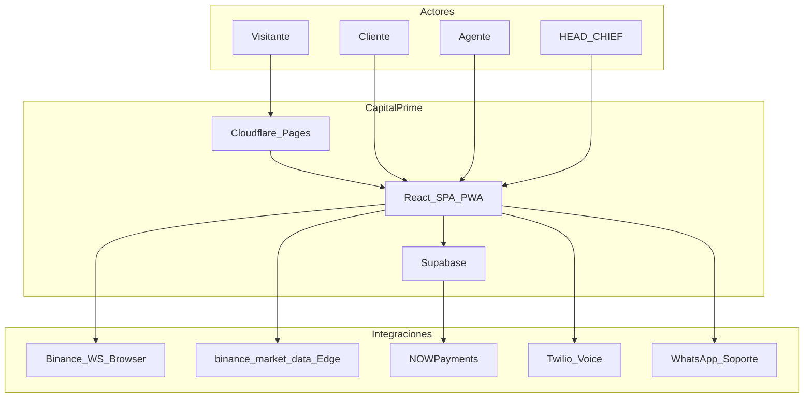
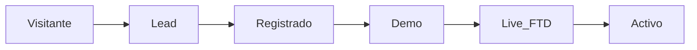
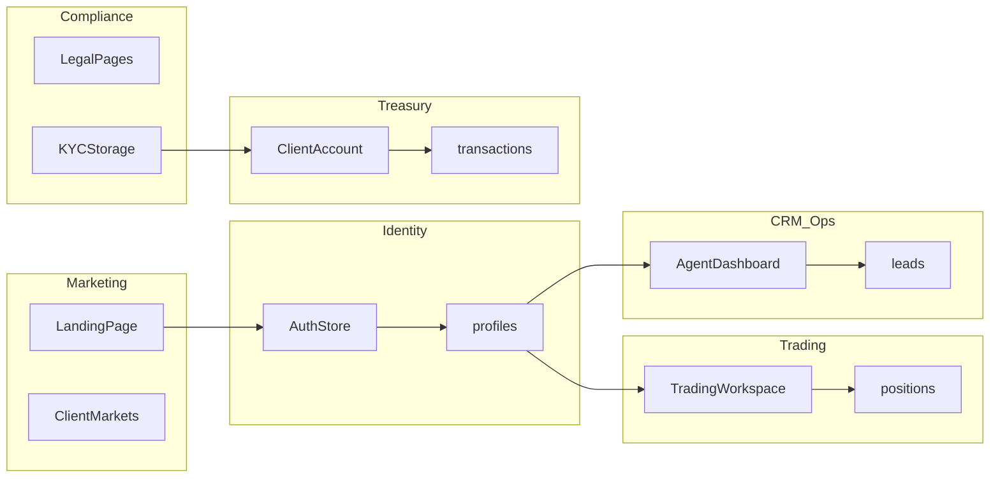
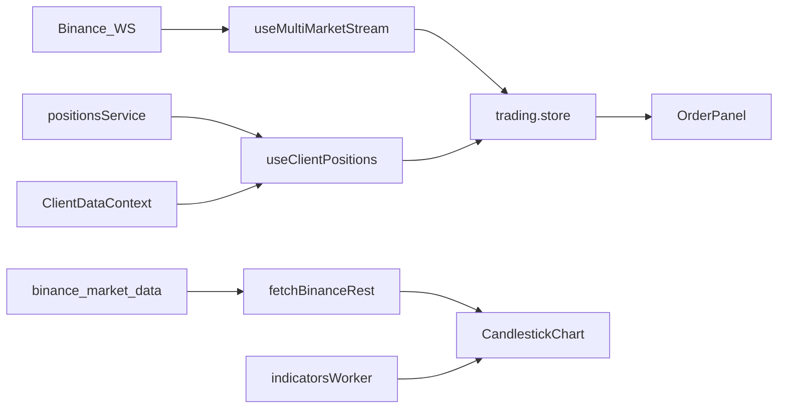
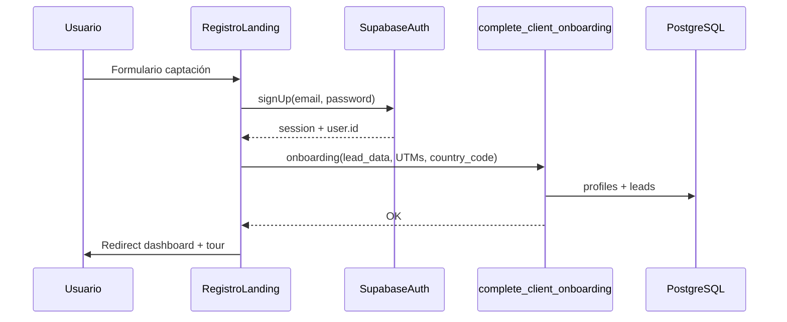

# Brief Técnico y Arquitectónico — CAPITAL PRIME

> **Marca:** CapitalPrime (digital) · CAPITAL PRIME (institucional)  
> **Tagline:** *Donde el capital encuentra su máximo rendimiento.*  
> **Versión:** 3.0  
> **Fecha:** 29 de junio de 2026  
> **Clasificación:** Documento maestro de arquitectura e identidad  
> **Alcance geográfico:** Latinoamérica (multi-país)  
> **Repositorio:** `https://github.com/capitalp78-bit/capitalp78`  
> **Producción:** `https://capital-prime-csk.pages.dev` (Cloudflare Pages)  
> **Estado software:** Track A cerrado · **Track B Fase 3** activa — ver [`ESTADO_DESARROLLO.md`](ESTADO_DESARROLLO.md)  
> **Propósito:** Blueprint replicable para plataformas broker institucionales (web + terminal + CRM jerárquico + treasury + compliance) en mercados LATAM

---

## Índice

1. [Cómo usar este documento](#1-cómo-usar-este-documento)
2. [Ecosistema documental](#2-ecosistema-documental)
3. [Resumen ejecutivo](#3-resumen-ejecutivo)
4. [Estado del proyecto (jun 2026)](#4-estado-del-proyecto-jun-2026)
5. [Modelo de negocio resumido](#5-modelo-de-negocio-resumido)
6. [Identidad y design system (Dark Electric)](#6-identidad-y-design-system-dark-electric)
7. [Dominios y bounded contexts](#7-dominios-y-bounded-contexts)
8. [Decisiones arquitectónicas (ADR)](#8-decisiones-arquitectónicas-adr)
9. [Stack tecnológico](#9-stack-tecnológico)
10. [Arquitectura frontend](#10-arquitectura-frontend)
11. [Arquitectura backend (Supabase)](#11-arquitectura-backend-supabase)
12. [RBAC y permisos](#12-rbac-y-permisos)
13. [Flujos críticos end-to-end](#13-flujos-críticos-end-to-end)
14. [Motor de trading y riesgo](#14-motor-de-trading-y-riesgo)
15. [Seguridad y compliance](#15-seguridad-y-compliance)
16. [Track B y go-live](#16-track-b-y-go-live)
17. [DevOps, testing y variables](#17-devops-testing-y-variables)
18. [Playbook greenfield](#18-playbook-greenfield)
19. [Deuda técnica y anti-patrones](#19-deuda-técnica-y-anti-patrones)
20. [Glosario y evolución v2 → v3](#20-glosario-y-evolución-v2--v3)

---

## 1. Cómo usar este documento

| Audiencia | Qué leer |
|-----------|----------|
| **Stakeholders / inversores** | §3–5, §16 + [`REQUISITOS_INICIO.md`](REQUISITOS_INICIO.md) |
| **Diseño / Brand** | §6 completo + [`MANUAL_DE_MARCA.md`](MANUAL_DE_MARCA.md) v2.0 |
| **Arquitectos / tech leads** | Documento completo + [`ARQUITECTURA.md`](ARQUITECTURA.md) |
| **Equipo de desarrollo** | §7–14, §17 + [`PASOS.md`](PASOS.md) + [`CONTRATOS_API.md`](CONTRATOS_API.md) |
| **Operaciones / lanzamiento** | §4, §16 + [`TRACK_B.md`](TRACK_B.md) + [`RUNBOOK_OPERACIONES.md`](RUNBOOK_OPERACIONES.md) |
| **Greenfield (nuevo proyecto)** | §18 + [`GUIA_TECNICA_CONSTRUCCION.md`](GUIA_TECNICA_CONSTRUCCION.md) |

**Hilo vivo:** el snapshot operativo se actualiza en [`ESTADO_DESARROLLO.md`](ESTADO_DESARROLLO.md) cada sesión. Este brief describe el **diseño estable**; para el delta de la última semana, leer ESTADO primero.

**Jerarquía de fuentes de verdad:**

| Prioridad | Fuente | Uso |
|-----------|--------|-----|
| 1 | [`ESTADO_DESARROLLO.md`](ESTADO_DESARROLLO.md) | Snapshot operativo, Track B, inventario HEAD |
| 2 | Filesystem repo | `supabase/migrations/`, `supabase/functions/`, `src/features/` |
| 3 | [`package.json`](../package.json) | Versiones del stack |
| 4 | [`public/design/variables.css`](../public/design/variables.css) | Tokens Dark Electric |
| 5 | [`adr/`](adr/README.md) | ADR-001…011 |
| 6 | [`ARQUITECTURA.md`](ARQUITECTURA.md) / [`CONTRATOS_API.md`](CONTRATOS_API.md) | ER, tablas, RPCs — **no duplicar listas completas aquí** |

> **Advertencia:** algunos índices en docs legacy (p. ej. [`ARQUITECTURA.md`](ARQUITECTURA.md) §10 Edge Functions, [`adr/README.md`](adr/README.md) sin ADR-011) pueden estar desactualizados. Ante duda, verificar el **filesystem** del repo.

---

## 2. Ecosistema documental

| Documento | Rol |
|-----------|-----|
| **`BRIEF_TECNICO_ARQUITECTONICO.md`** | **Este archivo** — qué es el producto, dominios, flujos, estado, identidad |
| [`GUIA_TECNICA_CONSTRUCCION.md`](GUIA_TECNICA_CONSTRUCCION.md) | Cómo construir el proyecto de punta a punta |
| [`ARQUITECTURA.md`](ARQUITECTURA.md) | Diagramas, ER, tablas, RLS, RPCs |
| [`CONTRATOS_API.md`](CONTRATOS_API.md) | Contratos RPC, Edge Functions, webhooks |
| [`PASOS.md`](PASOS.md) | Fases técnicas 0–7 (cerradas) + Track B |
| [`ESTADO_DESARROLLO.md`](ESTADO_DESARROLLO.md) | Snapshot vivo por sesión |
| [`MODELO_DE_NEGOCIO.md`](MODELO_DE_NEGOCIO.md) | B-Book, unit economics |
| [`TRACK_B.md`](TRACK_B.md) | Lanzamiento operativo fiat-first |
| [`adr/`](adr/README.md) | Decisiones versionadas ADR-001…011 |
| [`roles/`](roles/README.md) | Fichas por rol (8 roles) |
| [`SEGURIDAD_Y_COMPLIANCE.md`](SEGURIDAD_Y_COMPLIANCE.md) | Seguridad multicapa |
| [`MANUAL_DE_MARCA.md`](MANUAL_DE_MARCA.md) | Identidad visual Dark Electric |

---

## 3. Resumen ejecutivo

### 3.1 Qué es CapitalPrime

**CapitalPrime** (presentación institucional: **CAPITAL PRIME**) es una plataforma web de broker / trading CFD orientada a inversores retail exigentes en **Latinoamérica**. Opera en dos mundos:

| Mundo | Rutas | Usuarios | Objetivo |
|-------|-------|----------|----------|
| **Público** | `/`, `/registro`, `/mercados`, `/legal/*`, `/noticias-economicas` | Visitantes, leads | Marketing, captación, educación, legal |
| **Privado** | `/dashboard/*` | Clientes y equipo de ventas | Trading, treasury, CRM, auditoría |

La plataforma integra en un solo producto lo que tradicionalmente son sistemas separados: terminal de mercado, wallet, CRM de call center con jerarquía institucional, pasarela de pagos (fiat + crypto) y módulo de cumplimiento normativo.

> **Nota histórica:** el código y documentación antigua referencian *InvestPRO* / *Fortrade*. Esos nombres están **deprecados**. Toda implementación nueva usa CapitalPrime y tokens `--cp-*`.

### 3.2 Propuesta de valor

| Actor | Valor |
|-------|-------|
| **Inversor** | Terminal web en tiempo real (28 instrumentos), cuenta demo/live unificada, SL/TP, PWA instalable, soporte WhatsApp |
| **Ventas** | CRM leads, importación Excel, pools, ranking (dialer Twilio en backlog) |
| **Dirección (HEAD)** | Backoffice 360°: clientes, treasury, conciliación, comisiones, integraciones, salud BD |
| **Compliance** | T&C versionados por país, KYC/AML, advertencias de riesgo, `audit_log` |

### 3.3 Mercado LATAM

- **Región:** Latinoamérica multi-país — un núcleo tecnológico, capas locales por `country_code` (ADR-010).
- **Wallet interna:** USD operativo; display y depósitos fiat en moneda local según perfil.
- **Modelo de contraparte:** B-Book simulado (broker como contraparte; sin envío a mercado externo en MVP).

#### Matriz de despliegue

| País | Código | Moneda | Rail fiat MVP | Prioridad |
|------|--------|--------|---------------|:---------:|
| Colombia | `CO` | COP | Transferencia manual + aprobación CHIEF | **P1** |
| Perú | `PE` | PEN | `ManualDepositPeruFlow` | **P1** |
| México | `MX` | MXN | Fase 2 | P2 |
| Chile | `CL` | CLP | Fase 2 | P2 |
| Otros LATAM | `*` | Variable | Crypto + fiat bajo demanda | P3+ |

#### Principios multi-país (obligatorios)

1. Un código, varias jurisdicciones — feature flags + config por `country_code`.
2. Compliance antes que rail — no habilitar fiat sin T&C y KYC del país.
3. `country_code` en `profiles` y `leads` gobierna legal, fiat, KYC y métricas FTD/AUM.
4. CRM sin fronteras — agentes atienden leads multi-país.

### 3.4 Diagrama de contexto (C4 — Nivel 1)



---

## 4. Estado del proyecto (jun 2026)

### 4.1 Snapshot general

| Aspecto | Estado |
|---------|--------|
| **Track A** (Fases 0–7 software) | ✅ Cerrado |
| **Track B Fase 3** (validación fiat prod) | ⬜ Activa — smoke pendiente |
| Frontend SPA | ✅ React 19 + Vite 6 + TypeScript |
| Auth + RBAC (8 roles en `ROLE_HOME`) | ✅ Operativo |
| Terminal trading + WS Binance | ✅ 28 instrumentos |
| SL/TP brackets | ✅ Cliente + Edge `evaluate-position-brackets` |
| Proxy REST klines | ✅ Edge `binance-market-data` (prod) |
| Wallet fiat CO/PE + crypto UI | ✅ Software listo |
| CRM Agent → HEAD | ✅ ~27 rutas HEAD implementadas |
| Design system Dark Electric | ✅ ADR-011 implementado |
| PWA | ✅ `vite-plugin-pwa` + `PwaInstallPrompt` |
| Supabase | ✅ 37 migraciones · historial sincronizado |
| Edge Functions | ✅ 9 carpetas en `supabase/functions/` |
| Cloudflare Pages | ✅ `https://capital-prime-csk.pages.dev` |
| RLS tablas `public` | ✅ + `npm run test:rls` |
| NOWPayments / Twilio / Binance Pay secrets | ⏸️ Backlog (fiat-first) |
| Dominio `capitalprime.com` | ⬜ Pendiente HEAD |
| Storage `deposit-receipts` políticas | ⬜ Pendiente Track B |

### 4.2 Software verificado (Track B)

- [x] `npm run setup:fase7` OK
- [x] `npm run setup:track-b` OK (unit + build)
- [x] E2E Playwright 6/6 (local)
- [x] `test:deposit` / `test:trading` / `test:crm` / `test:rls` OK
- [x] `deploy:edge-functions` / `deploy:cloudflare` OK
- [ ] Re-deploy con `VITE_APP_URL` prod
- [ ] `verify:prod-smoke` contra prod (4 escenarios Fase 3)

---

## 5. Modelo de negocio resumido

CapitalPrime opera en **B-Book simulado**: el broker es contraparte de las operaciones del cliente. No hay envío de órdenes a mercado externo en el MVP.

### Cadena de valor del cliente



| Segmento | Objetivo operativo |
|----------|-------------------|
| Visitante | Captación, educación de marca |
| Lead | Contacto agente, conversión a registro |
| Registrado | Activar demo, educar terminal |
| Cliente demo | Familiarización con `demo_balance` |
| Cliente live (FTD) | Primera operación real — **KPI crítico lanzamiento** |
| Cliente activo | Volumen, spread revenue, retención |

### Fuentes de ingreso (MVP)

- Spread markup sobre precios Binance
- Comisiones / swaps (configurables)
- Pérdidas netas del cliente (riesgo B-Book para el broker)

Detalle completo: [`MODELO_DE_NEGOCIO.md`](MODELO_DE_NEGOCIO.md) · [`RIESGO_BBOOK.md`](RIESGO_BBOOK.md).

---

## 6. Identidad y design system (Dark Electric)

> **ADR-011** supersede la paleta navy/champagne de ADR-009 como sistema visual activo. Los tokens legacy (`--cp-champagne`, `--cp-navy`) existen solo como **aliases** de compatibilidad.

### 6.1 Nomenclatura de marca

| Contexto | Forma | Ejemplo |
|----------|-------|---------|
| Digital (apps, UI, código) | `CapitalPrime` | Títulos, emails transaccionales |
| Institucional (logo, legal) | `CAPITAL PRIME` | Wordmark, contratos |
| Código / archivos | `capital-prime`, `--cp-*` | `capital-prime-semantic.css` |
| Dominio objetivo | `capitalprime.com` | `VITE_APP_URL` en prod |

### 6.2 Paleta activa (fuente: `public/design/variables.css`)

| Token | Valor | Rol |
|-------|-------|-----|
| `--cp-void` | `#0a0b0f` | Fondo base (substrato near-black) |
| `--cp-graphite` | `#14151c` | Superficies |
| `--cp-panel` | `#1e2029` | Cards, paneles |
| `--cp-elevated` | `#2a2b38` | Elementos elevados |
| `--cp-ember` | `#EA8B19` | Acento firma — CTAs, wordmark highlight |
| `--cp-ember-hi` | `#ffb454` | Hover CTA |
| `--cp-up` / `--cp-down` | `#28e08c` / `#ff3a5c` | Long / Short terminal |
| `--cp-warn` | `#f5d547` | Margin call, advertencias |
| `--cp-info` | `#3fe9ff` | Badge live |
| `--cp-indigo` | `#5b6bff` | Acento secundario |

**Aliases legacy (no usar en diseño nuevo):** `--cp-champagne` → `--cp-ember`, `--cp-navy` → `--cp-void`, `--cp-buy` → `--cp-up`.

### 6.3 Tipografía

| Rol | Fuente |
|-----|--------|
| Display | Space Grotesk |
| UI | Inter |
| Datos / terminal | JetBrains Mono |

### 6.4 Componentes y archivos clave

| Archivo | Rol |
|---------|-----|
| `public/design/variables.css` | Tokens CSS globales `--cp-*` |
| `src/styles/capital-prime-semantic.css` | Semántica por superficie |
| `src/styles/cp-buttons.css` | CTAs, touch targets, animación estrellas |
| `src/shared/components/Button.tsx` | Variantes `primary\|up\|down\|secondary\|ghost\|link\|toggle` |
| `src/shared/theme/capital-prime-theme.ts` | Objeto TS para lógica JS |

### 6.5 Reglas prohibidas

- Nombres o colores **InvestPRO**, **Fortrade**, `#9fe870`
- Librerías UI genéricas no aprobadas: shadcn/ui, MUI, Recharts
- Mezclar formas de marca en la misma superficie

### 6.6 Temas

- **Dark** por defecto (`color-scheme: dark`)
- **Light** vía `[data-theme='light']` — hero landing y secciones públicas

Skill Cursor: `.cursor/skills/ui-dark-electric/`

---

## 7. Dominios y bounded contexts

### 7.1 Mapa de dominios

| Dominio | Responsabilidad | Módulo `src/features/` | Persistencia principal |
|---------|-----------------|------------------------|------------------------|
| **Marketing** | Landing, captación, SEO, ticker | `landing`, `markets` | `leads`, CMS, Storage |
| **Identity** | Auth, sesión, roles, guards | `auth` | `auth.users`, `profiles` |
| **Trading** | Terminal, posiciones, órdenes, charts | `trading`, `risk` | `positions`, `pending_orders` |
| **Treasury** | Depósitos, retiros, conciliación | `wallet`, `treasury`, `client` | `wallets`, `transactions`, `company_bank_accounts` |
| **CRM Ops** | Leads, dialer, SOS, ranking | `crm`, `dashboard` | `leads`, `call_logs`, `sos_alerts` |
| **Compliance** | Legal, KYC/AML | `legal`, `compliance` | Storage KYC, `profiles.kyc_*` |
| **Admin HEAD** | Backoffice dirección | `admin` | RPCs `head_*`, `staff_*` |
| **CMS** | Contenido editable | `studio` | Tablas CMS + rol DESIGNER |
| **Engagement** | Notificaciones, tour, toasts | `notifications` | `client_notifications` |

**15 módulos en `src/features/`:** `admin`, `auth`, `client`, `compliance`, `crm`, `dashboard`, `landing`, `legal`, `markets`, `notifications`, `risk`, `studio`, `trading`, `treasury`, `wallet`.

### 7.2 Reglas de acoplamiento

1. **Trading no llama directamente a CRM** — relación cliente–agente en `profiles` / `leads`.
2. **Treasury muta balances solo vía RPC** — nunca `UPDATE` directo a `wallets` desde el cliente.
3. **Identity es fuente de verdad del rol** — navegación y RLS derivan de `profiles.role`.
4. **Marketing crea leads; CRM los gestiona** — `/registro` → `complete_client_onboarding`.
5. **Compliance bloquea Treasury** — sin KYC nivel 2, retiros y fiat completos restringidos.
6. **`country_code` gobierna rails y legal** — ADR-010.

### 7.3 Diagrama de bounded contexts



---

## 8. Decisiones arquitectónicas (ADR)

Resumen ejecutivo. Detalle en [`adr/`](adr/README.md).

| ID | Título | Estado | Notas v3.0 |
|----|--------|--------|------------|
| [ADR-001](adr/ADR-001-supabase-baas.md) | Backend BaaS (Supabase) | Aceptada | Postgres + Auth + Storage + Edge |
| [ADR-002](adr/ADR-002-frontend-feature-based.md) | Frontend feature-based | Aceptada | `src/features/*` |
| [ADR-003](adr/ADR-003-zustand-realtime.md) | Zustand tiempo real | Aceptada | Trading store, auth |
| [ADR-004](adr/ADR-004-server-state.md) | Estado servidor | Aceptada | Context + servicios; React Query **no cableado** |
| [ADR-005](adr/ADR-005-rls-rpcs.md) | RLS mínimo + RPCs | Aceptada | Evita recursión RLS |
| [ADR-006](adr/ADR-006-binance-ws-browser.md) | Binance WS al browser | Aceptada | + proxy REST vía Edge en prod |
| [ADR-007](adr/ADR-007-edge-functions.md) | Edge para integraciones | Aceptada | Ampliado: news, brackets, Binance REST |
| [ADR-008](adr/ADR-008-demo-live.md) | Demo/live misma cuenta | Aceptada | `account_mode`, `demo_balance` |
| [ADR-009](adr/ADR-009-identidad-capitalprime.md) | Identidad CapitalPrime | Aceptada | **Superseded visualmente** por ADR-011 |
| [ADR-010](adr/ADR-010-latam-multi-pais.md) | LATAM multi-país | Aceptada | `country_code` |
| [ADR-011](adr/ADR-011-rebrand-dark-electric.md) | Dark Electric | Aceptada | Sistema visual activo |

---

## 9. Stack tecnológico

### 9.1 Versiones reales (`package.json`)

| Tecnología | Versión | Rol |
|------------|---------|-----|
| React | ^19.0 | UI, StrictMode |
| Vite | ^6.2 | Build, HMR, PWA |
| TypeScript | ~5.7 | Tipado estricto |
| Tailwind CSS | ^4.0 (`@tailwindcss/vite`) | Utility + tokens `--cp-*` |
| React Router | ^7.4 | Routing SPA |
| Zustand | ^5.0 | Estado reactivo (trading, auth) |
| TanStack React Query | ^5.69 | Instalado; **no cableado en runtime** |
| lightweight-charts | ^5.2 | Gráficos candlestick |
| @supabase/supabase-js | ^2.49 | Auth, DB, Storage, Realtime |
| i18next | ^26 | Internacionalización es/en |
| cmdk | ^1.1 | Command palette HEAD (`Ctrl+K`) |
| libphonenumber-js | ^1.13 | Normalización teléfonos E.164 |
| xlsx | ^0.18 | Importación Excel leads |
| @dnd-kit/* | ^6–10 | Drag-and-drop Studio |
| Vitest | ^3.0 | Tests unitarios |
| Playwright | ^1.60 | E2E |
| vite-plugin-pwa | ^1.3 | PWA |
| Wrangler | ^4.14 | Deploy Cloudflare Pages |

> **Nota:** usar siempre `package.json` como fuente de verdad de versiones. Documentos que citen Vite 8 u otras versiones antiguas están desactualizados.

### 9.2 Infraestructura

| Capa | Servicio |
|------|----------|
| Hosting frontend | Cloudflare Pages (`public/_headers`, `_redirects`, CSP, HSTS) |
| Backend | Supabase Cloud (PostgreSQL, GoTrue, Storage, Realtime, Edge) |
| CI | GitHub Actions (`.github/workflows/ci.yml`) |
| Precios tiempo real | Binance WebSocket (browser directo) |
| Precios históricos (klines) | Edge `binance-market-data` (prod); proxy `/binance-api` solo dev |

### 9.3 Matriz de integraciones

| Integración | Software | Operativo |
|-------------|----------|-----------|
| Depósito fiat manual CO/PE | ✅ UI + RPCs | ⬜ Validación prod Fase 3 |
| Depósito crypto NOWPayments | ✅ UI + webhook en repo | ⏸️ Sin secrets |
| Binance Pay | ✅ Migración + webhook | ⏸️ Deploy/secrets pendientes |
| Twilio Voice | ✅ Edge `twilio-voice-token` | ⏸️ Sin SDK frontend ni secrets |
| WhatsApp soporte | ✅ `get_public_support_config` | ✅ |
| Noticias económicas | ✅ Edge `economy-news-feed` | ✅ |
| GTM / atribución | ✅ `VITE_GTM_ID` opcional | Según marketing |
| Resend email | Documentado en integraciones | Según deploy |

Detalle: [`INTEGRACIONES.md`](INTEGRACIONES.md) · webhooks en [`integraciones/`](integraciones/WEBHOOK_NOWPAYMENTS.md).

---

## 10. Arquitectura frontend

### 10.1 Bootstrap y cadena de render

```
main.tsx
  └─ StrictMode
       └─ App.tsx
            ├─ useAuthStore.initialize()   ← sesión Supabase + rol
            └─ RouterProvider(router)      ← src/app/router.tsx
```

No existe `providers.tsx` global. Providers locales por feature:

| Provider / capa | Archivo / componente | Alcance |
|-----------------|----------------------|---------|
| `ClientDataProvider` | `src/features/client/context/ClientDataContext.tsx` | Rol CLIENT |
| `TradingPositionsProvider` | `src/features/trading/context/TradingPositionsContext.tsx` | Ruta trade |
| `ClientEngagementLayer` | engagement / tour / toasts | CLIENT |
| `SupportWidget` | burbuja WhatsApp global | Toda la app |
| `RouteScrollManager` | scroll top rutas públicas | Landing |

### 10.2 Capas del frontend

```
┌─────────────────────────────────────────────────────────┐
│  PRESENTACIÓN — features/*/components, shared/ui        │
├─────────────────────────────────────────────────────────┤
│  LÓGICA DE DOMINIO — features/*/hooks, store, context │
├─────────────────────────────────────────────────────────┤
│  SERVICIOS — src/core/supabase/services/*               │
├─────────────────────────────────────────────────────────┤
│  INFRA CLIENTE — config/supabase.ts, router, theme      │
└─────────────────────────────────────────────────────────┘
```

### 10.3 Routing y guards

**Archivo central:** `src/app/router.tsx`

| Zona | Rutas ejemplo | Guard |
|------|---------------|-------|
| Pública | `/`, `/registro`, `/mercados`, `/legal/*`, `/noticias-economicas` | Ninguno |
| Privada | `/dashboard/*` | `MainLayout` → redirect login |

**Redirección por rol (`src/shared/routing/paths.ts`):**

```typescript
ROLE_HOME = {
  CLIENT:        '/dashboard/trade',
  AGENT:         '/dashboard/agent',
  TEAM_LEADER:   '/dashboard/team-leader',
  FLOOR_MANAGER: '/dashboard/floor',
  MANAGER:       '/dashboard/manager',
  CHIEF:         '/dashboard/chief',
  HEAD:          '/dashboard/head',
  DESIGNER:      '/dashboard/studio',
}
```

Acceso por ruta: `src/shared/routing/role-access.ts` + `RequireRouteAccess`. Verificación: `npm run verify:route-sync`.

### 10.4 Patrones obligatorios

1. Servicios async puros en `src/core/supabase/services/`.
2. RPC para operaciones sensibles — nunca UPDATE directo a `wallets` o `positions`.
3. Selectores atómicos Zustand — `useTradingStore(s => s.currentPrices['BTCUSDT'])`.
4. Web Worker para indicadores — `src/features/trading/workers/indicators.worker.ts`.
5. Design tokens `--cp-*` — fuente única en `variables.css`.
6. Rutas centralizadas en `src/shared/routing/paths.ts`.

### 10.5 Composición trading

```
TradingWorkspace / TradePanelShell
  ├─ TradingPositionsProvider
  │    └─ useMultiMarketStream()     → Binance WS → trading.store
  │    ├─ usePendingOrderWatcher()   → órdenes LIMIT/STOP
  │    ├─ BracketInputs / PositionsPanel  → SL/TP
  │    ├─ CandlestickChart
  │    │    ├─ fetchBinanceRest → Edge binance-market-data
  │    │    └─ useIndicatorWorker
  │    └─ OrderEntryForm / OrderPanel
```

### 10.6 UX cliente (implementado jun 2026)

| Feature | Descripción |
|---------|-------------|
| Tab bar móvil | 5 destinos Operar / Perfil (<1024px) |
| `ClientAccountModeBar` | Toggle demo/live, saldos dual, recarga demo |
| `ClientMarketsPage` | 28 instrumentos, sidebar live, terminal Pro/Rápido |
| `QuickTradeSheet` | Trading rápido solo móvil |
| SL/TP brackets | Apertura y edición en posiciones abiertas |
| PWA | `PwaInstallPrompt` — requiere HTTPS (Cloudflare) |

### 10.7 UX landing y público

| Feature | Descripción |
|---------|-------------|
| `HOME_LAYOUT_V3` | hero → stats → bento → cta → accounts → trust → faq |
| `HeroMarketsWidget` | Tabs/lista instrumentos en hero |
| Hero light | Overlay + `.cp-hero-headline` + highlight ember |
| `/noticias-economicas` | Feed Edge + ticker landing |
| i18n | ES/EN funcional (selector en topbar HEAD) |

### 10.8 Flujo de datos trading



---

## 11. Arquitectura backend (Supabase)

### 11.1 Topología

```
┌─────────────────────────────────────────────────────────┐
│  SUPABASE CLOUD                                         │
│  ├─ Auth (GoTrue)        → JWT, email/password, 2FA     │
│  ├─ PostgreSQL + RLS     → 37 migraciones, RPCs         │
│  ├─ Storage              → KYC, comprobantes, leads CSV │
│  ├─ Realtime             → SOS, notificaciones          │
│  └─ Edge Functions (9)   → webhooks, proxy, brackets    │
└─────────────────────────────────────────────────────────┘
```

### 11.2 Modelo de tablas (agrupado por dominio)

> Detalle ER completo: [`ARQUITECTURA.md`](ARQUITECTURA.md) §5–6. Contratos RPC: [`CONTRATOS_API.md`](CONTRATOS_API.md).

**Identity / CRM**

| Tabla | Propósito |
|-------|-----------|
| `auth.users` | Identidad (email, password hash) |
| `profiles` | Rol, equipo, KYC, `country_code`, presencia |
| `teams` | Mesas de agentes (RLS deny-by-default) |
| `leads` | Embudo CRM + atribución marketing |
| `lead_callbacks`, `call_logs`, `sos_alerts` | Operaciones CRM |
| `lead_registration_files` | Metadata importación leads |

**Treasury**

| Tabla | Propósito |
|-------|-----------|
| `wallets` | `balance`, `demo_balance`, `leverage`, `account_mode` |
| `transactions` | Depósitos/retiros (fiat + crypto rails) |
| `company_bank_accounts` | Cuentas banco empresa por `country_code` |
| `client_payout_profiles` | Datos retiro (CCI, CLABE, crypto, etc.) |
| `crypto_addresses` | Direcciones depósito crypto |

**Trading**

| Tabla | Propósito |
|-------|-----------|
| `positions` | Posiciones abiertas/cerradas + SL/TP brackets |
| `pending_orders` | Órdenes límite/stop pendientes |
| `risk_settings` | Configuración riesgo global |

**Admin / HEAD**

| Tabla / concepto | Propósito |
|------------------|-----------|
| `audit_log` | Trazabilidad inmutable |
| `commission_plans`, targets | Comisiones por rol |
| `feature_flags`, `api_keys` | Plugins e integraciones |
| `loan_requests` | Préstamos internos |
| `platform_config` | Config global HEAD |
| CMS (Studio) | Contenido editable por DESIGNER |

### 11.3 Patrón RLS (jun 2026)

1. **RLS habilitado** en todas las tablas `public` con datos de usuario.
2. **`profiles`:** política mínima `profiles_own_row` (`auth.uid() = id`).
3. **Staff no lee otros perfiles vía RLS** — RPCs `SECURITY DEFINER`:
   - `staff_list_profiles`, `staff_get_profile`, `staff_update_profile`
4. **Helpers:** `get_my_role()`, `is_leadership()`, `is_staff_management()`.
5. **Mutaciones financieras siempre vía RPC:**
   - `open_position_with_risk`, `create_deposit_transaction`
   - `complete_client_onboarding`, `ensure_my_wallet`, `ensure_demo_funds`
6. **Tests:** `npm run test:rls` — IDOR, escalación treasury, leadership CHIEF.

### 11.4 Edge Functions (inventario repo)

| Función | Responsabilidad |
|---------|-----------------|
| `binance-market-data` | Proxy REST Binance — klines (200 velas) en prod |
| `evaluate-position-brackets` | SL/TP automático (cron + trigger) |
| `economy-news-feed` | Noticias landing + `/noticias-economicas` |
| `create-deposit-for-client` | Agente crea depósito crypto |
| `create-client-crypto-deposit` | Cliente crea depósito crypto |
| `nowpayments-webhook` | IPN NOWPayments → acredita wallet |
| `binance-pay-webhook` | Webhook Binance Pay + firma HMAC |
| `twilio-voice-token` | JWT Twilio para dialer |
| `head-manage-client` | Operaciones HEAD sobre cliente |

**Módulos compartidos (`supabase/functions/_shared/`):**

- `binance-rest-proxy.ts`, `binance-ticker.ts`
- `bracket-validation.ts`
- `economy-news.ts`
- `webhook-signature.ts` (+ tests)

Deploy: `npm run deploy:edge-functions`

### 11.5 Migraciones

**37 archivos** en `supabase/migrations/` (20260610 → 20260628).

| Archivo | Contenido |
|---------|-----------|
| `20260610120000_identity.sql` | Auth, profiles, trigger `handle_new_user` |
| `20260613000000_treasury.sql` | Wallets, transactions |
| `20260614000000_trading.sql` | Posiciones, órdenes |
| `20260615000000_crm.sql` | Leads, call logs |
| `20260616000000_crm_hierarchy.sql` | Jerarquía staff |
| `20260617000000_compliance.sql` | KYC, legal |
| `20260618120000_track_b.sql` | Track B: crypto deposit RPC |
| `20260620000000_lead_imports.sql` | Import Excel, bucket `lead-registrations` |
| `20260621000001_cms.sql` | CMS Studio |
| `20260623100000_client_account_mode.sql` | Demo/live |
| `20260623120000_binance_pay_rail.sql` | Rail Binance Pay |
| `20260623130000_teams_rls.sql` | RLS teams deny-by-default |
| `20260624000000`–`050000` | Admin HEAD: users, desks, config, comisiones, loans, API |
| `20260626000000_public_support_config.sql` | WhatsApp soporte público |
| `20260626200000_position_brackets.sql` | SL/TP brackets |
| `20260627100000_client_upsert_payout_profile.sql` | Perfil retiro cliente |
| `20260628100000_generic_latam_deposit.sql` | Rail `manual_bank` LATAM |
| `20260628110000_crypto_deposit_max_amount.sql` | Límite depósito crypto |

Sincronización historial: `npm run sync:schema-migrations` → `npm run db:push`

---

## 12. RBAC y permisos

### 12.1 Jerarquía

**7 roles operativos** (ventas + cliente) + **DESIGNER** (CMS):

```
HEAD → CHIEF → MANAGER → FLOOR_MANAGER → TEAM_LEADER → AGENT → CLIENT
                                                              (+ DESIGNER → Studio)
```

### 12.2 Matriz de permisos simplificada

| Permiso | CLIENT | AGENT | TL+ | MANAGER+ | CHIEF | HEAD | DESIGNER |
|---------|:------:|:-----:|:---:|:--------:|:-----:|:----:|:--------:|
| Operar terminal | ✓ | — | — | — | — | — | — |
| Ver precios mercado | ✓ | ✓ | ✓ | ✓ | ✓ | ✓ | — |
| Dialer VoIP | — | ✓ | ✓ | — | — | — | — |
| Gestionar leads | — | ✓ | ✓ | ✓ | ✓ | ✓ | — |
| Monitorear SOS / agentes | — | — | ✓ | ✓ | ✓ | ✓ | — |
| Métricas globales | — | — | — | ✓ | ✓ | ✓ | — |
| Aprobar depósitos/retiros | — | — | — | — | ✓ | ✓ | — |
| Cambiar roles | — | — | — | — | — | ✓ | — |
| Editar CMS Studio | — | — | — | — | — | — | ✓ |

### 12.3 Rutas por rol

| Rol | Home (`ROLE_HOME`) |
|-----|-------------------|
| CLIENT | `/dashboard/trade` |
| AGENT | `/dashboard/agent` |
| TEAM_LEADER | `/dashboard/team-leader` |
| FLOOR_MANAGER | `/dashboard/floor` |
| MANAGER | `/dashboard/manager` |
| CHIEF | `/dashboard/chief` |
| HEAD | `/dashboard/head` |
| DESIGNER | `/dashboard/studio` |

Detalle operativo: [`roles/README.md`](roles/README.md) · [`MANUAL_ROLES.md`](MANUAL_ROLES.md).

### 12.4 CRM HEAD — pantallas implementadas

**Shell:** `AppSidebar` (menú agrupado, ember activo) · `AppTopBar` (`Ctrl+K`, idioma ES/EN) · `MainLayout` responsive.

#### Principal

| Ruta | Backend principal |
|------|-------------------|
| `/dashboard/head` | Control + métricas + ranking |
| `/dashboard/head/clientes` | `staff_list_profiles`, `staff_list_leads`, `staff_assign_lead` |
| `/dashboard/head/clientes/:userId` | Perfil 360° — `staff_get_profile`, wallets, transactions |
| `/dashboard/head/clientes/lead/:leadId` | `staff_get_lead`, `staff_update_lead` |
| `/dashboard/head/importar-excel` | `staff_import_leads_bulk` + bucket `lead-registrations` |
| `/dashboard/head/pools` | Pools de leads |
| `/dashboard/head/normalizar-telefonos` | `staff_update_phones_bulk` |
| `/dashboard/head/marketing` | Campañas admin |
| `/dashboard/head/transacciones` | Historial global + CSV |
| `/dashboard/head/conciliacion-efectivo` | Fiat manual + `company_bank_accounts` |
| `/dashboard/head/reconciliacion` | Txs vs `audit_log` |
| `/dashboard/head/crypto-wallet` | Depósitos crypto por rail |
| `/dashboard/head/pasarelas` | Stats integraciones 30d |
| `/dashboard/head/metodos-pago` | Cuentas banco por país |
| `/dashboard/head/tasas-cambio` | TRM histórico |

#### Cumplimiento, integraciones y administración

| Ruta | Backend principal |
|------|-------------------|
| `/dashboard/head/prestamos` | `staff_list_loan_requests`, `head_decide_loan` |
| `/dashboard/head/api` | `head_create/list/revoke_api_key` |
| `/dashboard/head/integraciones` | `head_list/toggle_connector` |
| `/dashboard/head/plugins` | `head_list/toggle_feature_flag` |
| `/dashboard/head/usuarios` | Staff CRUD — `head_set_staff_active`, `setUserRole` |
| `/dashboard/head/estado-empleados` | `last_seen_at`, `staff_recent_logins` |
| `/dashboard/head/roles` | `head_set_user_role` |
| `/dashboard/head/desks` | `head_*_team`, `staff_floor_overview` |
| `/dashboard/head/comisiones` | `head_*_commission_*` |
| `/dashboard/head/configuracion` | `head_get/update_platform_config`, `risk_settings` |
| `/dashboard/head/salud-bd` | `head_db_health` |
| `/dashboard/head/e2e` | `head_list_test_runs` |

**Menú HEAD:** todos los ítems en estado `ready` (sin badge PRONTO).

---

## 13. Flujos críticos end-to-end

### 13.1 Registro web



| Paso | Componente | Tabla / efecto |
|------|-----------|----------------|
| 1 | `/registro` → `auth.store.registerClient` | — |
| 2 | Supabase Auth `signUp` | `auth.users` |
| 3 | RPC `complete_client_onboarding` | `profiles`, `leads` + atribución |
| 4 | `ClientEngagementLayer` | Tour onboarding |

**Track B Fase 3 #1:** validar en prod con `country_code` CO/PE.

### 13.2 Depósito fiat LATAM

Patrón único reutilizable por país:

| Paso | Componente | Destino |
|------|-----------|---------|
| 1 | `DepositTab` → flujo por país (`ManualDepositPeruFlow`, Colombia, genérico LATAM) | Lee `profiles.country_code` |
| 2 | RPC `create_deposit_transaction` | `transactions` (pending) |
| 3 | Upload comprobante | Storage `deposit-receipts/` (políticas pendientes) |
| 4 | CHIEF aprueba en dashboard | RPC aprobación |
| 5 | Conversión local → USD wallet | `wallets.balance` ↑ |

| País | Moneda tx | Cuenta empresa |
|------|-----------|----------------|
| Perú (`PE`) | PEN → USD | `company_bank_accounts` PE |
| Colombia (`CO`) | COP → USD | `company_bank_accounts` CO |
| Genérico LATAM | USD `manual_bank` | `20260628100000_generic_latam_deposit` |

**Track B Fase 3 #2:** primer depósito fiat real aprobado por CHIEF.

### 13.3 Depósito crypto (NOWPayments)

| Paso | Componente | Destino |
|------|-----------|---------|
| 1 | Cliente o agente inicia depósito | UI wallet |
| 2 | Edge `create-client-crypto-deposit` o `create-deposit-for-client` | RPC + invoice |
| 3 | Cliente paga | NOWPayments |
| 4 | IPN webhook | Edge `nowpayments-webhook` |
| 5 | Acreditación | `wallets.balance` ↑, `transactions` completed |

Estado operativo: ⏸️ secrets NOWPayments pendientes (fiat-first).

### 13.4 Trading con SL/TP

| Paso | Componente | Destino |
|------|-----------|---------|
| 1 | `OrderPanel` / `OrderEntryForm` → `order-guards.ts` | Validación local |
| 2 | RPC `open_position_with_risk` | Verifica margen en DB |
| 3 | `BracketInputs` opcional | SL/TP en `positions` |
| 4 | Sync frontend | `useClientPositions` → `trading.store` |
| 5 | Precio toca bracket | Watcher cliente + Edge `evaluate-position-brackets` |

**Track B Fase 3 #3:** FTD → primera operación live.

### 13.5 Precios de mercado

| Canal | Implementación | Uso |
|-------|----------------|-----|
| Tiempo real | `useMultiMarketStream` → Binance WS | Ticks, P&L flotante |
| Histórico | `fetchBinanceRest` → Edge `binance-market-data` | Candlestick 200 klines |
| Dev only | Proxy Cloudflare `/binance-api` | No usar en prod |

28 instrumentos en `BINANCE_REST_SYMBOLS`.

### 13.6 Margin call / stop out

| Paso | Componente | Efecto |
|------|-----------|--------|
| 1 | Binance WS tick | `trading.store.setPrice` |
| 2 | `deriveMetrics` | Recalcula equity, margen |
| 3 | `marginLevel` < 100% | Alerta UI + bloqueo nuevas órdenes |
| 4 | `marginLevel` ≤ 50% | Stop out — cierre automático |

**Track B Fase 3 #4:** validar UI margin call en prod.

### 13.7 Soporte y engagement

| Flujo | Implementación |
|-------|----------------|
| WhatsApp | `SupportWidget` + RPC `get_public_support_config` |
| Noticias | Edge `economy-news-feed` → `/noticias-economicas` + ticker |
| Engagement | `ClientEngagementLayer` — toasts, tour, next action card |

### 13.8 Llamada CRM (Twilio) — backlog

| Paso | Componente | Destino |
|------|-----------|---------|
| 1 | Agente click "Llamar" | — |
| 2 | Edge `twilio-voice-token` | JWT Twilio |
| 3 | SDK browser (pendiente en `package.json`) | Conexión VoIP |
| 4 | Webhook Twilio | `call_logs` |

---

## 14. Motor de trading y riesgo

### 14.1 Fórmulas financieras

```
Balance       = depósitos + P&L realizado (posiciones cerradas)
Floating P&L  = Σ (precio_actual - precio_apertura) × volumen × valor_pip
Equity        = Balance + Floating P&L
Margen usado  = Σ (volumen × precio × contrato) / leverage
Margen libre  = Equity - Margen usado
Nivel margen  = (Equity / Margen usado) × 100
```

### 14.2 Umbrales de riesgo

| Nivel margen | Estado | Token | Acción |
|-------------|--------|-------|--------|
| ≥ 200% | SALUDABLE | `--cp-up` | Operación normal |
| 100–200% | ALERTA | `--cp-warn` | Advertencia UI |
| < 100% | MARGIN CALL | `--cp-down` | Bloqueo apertura |
| ≤ 50% | STOP OUT | `--cp-down` | Cierre automático |

### 14.3 Modos demo / live (ADR-008)

| Campo | Tabla | Descripción |
|-------|-------|-------------|
| `account_mode` | `wallets` | `'demo'` o `'live'` |
| `demo_balance` | `wallets` | Balance ficticio |
| `balance` | `wallets` | Balance real |

RPC: `ensure_demo_funds` — recarga demo sin afectar balance real.

UI: `ClientAccountModeBar` + badge demo/live (ADR-008).

### 14.4 SL/TP brackets

- Migración: `20260626200000_position_brackets.sql`
- UI: `BracketInputs`, edición en `PositionsPanel`
- Automático: Edge `evaluate-position-brackets` + validación `_shared/bracket-validation.ts`

### 14.5 Archivos de referencia

- `src/features/trading/utils/margin.calculator.ts`
- `src/features/trading/store/trading.store.ts`
- `src/features/trading/utils/order-guards.ts`
- `src/features/trading/workers/indicators.worker.ts`

---

## 15. Seguridad y compliance

### 15.1 Modelo de capas

```
Capa 7 — Aplicación:     CSP, sanitización, RBAC en UI
Capa 6 — Sesión:         JWT Supabase, 2FA TOTP (parcial por rol)
Capa 5 — API Gateway:    Rate limiting, WAF (Cloudflare)
Capa 4 — Base de datos:  RLS, cifrado en reposo, audit_log
Capa 3 — Red:            TLS 1.3, HSTS
Capa 2 — Infraestructura: Firewall Supabase / Cloudflare
Capa 1 — Monitoreo:      Logs, alertas, incident response
```

### 15.2 Clasificación de datos

| Dato | Nivel | Protección |
|------|-------|------------|
| Contraseñas | Crítico | bcrypt (Supabase Auth) |
| Documentos KYC | Crítico | Storage + signed URLs |
| Balances / posiciones | Sensible | RLS + RPCs |
| Leads / teléfonos | Sensible | RPC staff + asignación |
| Logs audit | Interno | Solo HEAD/CHIEF |

### 15.3 2FA por rol

| Rol | 2FA obligatorio en |
|-----|-------------------|
| CLIENT | Retiros, cambio contraseña |
| AGENT | Login |
| TEAM_LEADER+ | Login + acciones admin |
| HEAD | Login + operaciones sensibles |

### 15.4 Checklist mínimo greenfield

- [ ] RLS en todas las tablas con datos de usuario
- [ ] Política mínima `profiles` + RPCs staff
- [ ] Mutaciones financieras solo vía RPC `SECURITY DEFINER`
- [ ] Secretos solo en Edge Functions / env servidor
- [ ] `audit_log` inmutable
- [ ] Headers CSP + HSTS en producción
- [ ] `npm run test:rls` en CI

Detalle: [`SEGURIDAD_Y_COMPLIANCE.md`](SEGURIDAD_Y_COMPLIANCE.md) · [`LEGAL_LATAM.md`](LEGAL_LATAM.md).

---

## 16. Track B y go-live

### 16.1 Alcance fiat-first

Producción HTTPS + depósito **fiat** CO/PE. Crypto y Twilio pospuestos hasta secrets operativos.

### 16.2 Fase 3 — Validación prod (activa)

| # | Escenario | Estado |
|---|-----------|--------|
| 1 | `/registro` → lead + `country_code` | ⬜ |
| 2 | Depósito fiat → CHIEF aprueba | ⬜ |
| 3 | FTD → trade live | ⬜ |
| 4 | Margin call UI | ⬜ |

```powershell
$env:PROD_URL="https://capital-prime-csk.pages.dev"
npm run verify:prod-smoke
npm run print:auth-urls
```

Supabase Auth → URL Configuration → redirect URLs de prod.

### 16.3 Handoff HEAD (paralelo)

| Tarea | Estado |
|-------|--------|
| Constituir SAS Colombia | ⬜ |
| Cuenta bancaria COP + USD | ⬜ |
| Dominio `capitalprime.com` → Cloudflare | ⬜ |
| Supabase Pro (PITR) | ⬜ |
| Legal revisado + publicado en prod | ⬜ |
| CHIEF + 4–6 agentes + capacitación | ⬜ |
| Go-live Ads CO/PE (5–10 FTD fiat) | ⬜ |

Referencia: [`TRACK_B.md`](TRACK_B.md) · [`REQUISITOS_INICIO.md`](REQUISITOS_INICIO.md) §8.

### 16.4 Backlog diferido

- NOWPayments + Twilio + Binance Pay: secrets en Supabase Dashboard
- Storage `deposit-receipts`: políticas RLS
- Re-deploy con `VITE_APP_URL` apuntando a dominio final

---

## 17. DevOps, testing y variables

### 17.1 Scripts operativos (`package.json`)

| Comando | Qué hace |
|---------|----------|
| `npm run dev` | Servidor desarrollo Vite |
| `npm run build` | Build producción + PWA |
| `npm test` | Vitest unitarios |
| `npm run test:e2e` | Playwright E2E |
| `npm run setup:fase7` | Verificación Fase 7 |
| `npm run setup:track-b` | Verificación completa Track B |
| `npm run db:push` | Migraciones Supabase CLI |
| `npm run db:push:pooler` | Push vía pooler (IPv6 fallback) |
| `npm run sync:schema-migrations` | Sincronizar historial remoto |
| `npm run deploy:edge-functions` | Deploy Edge Functions |
| `npm run deploy:cloudflare` | Deploy Cloudflare Pages |
| `npm run verify:prod-smoke` | Smoke contra prod |
| `npm run verify:route-sync` | RBAC rutas vs router |
| `npm run test:rls` | Aislamiento RLS |
| `npm run test:deposit` | Flujo depósito |
| `npm run test:trading` | Flujo trading |
| `npm run test:crm` | Flujo CRM |
| `npm run test:head-crm` | Flujo HEAD CRM |
| `npm run seed:dev-users` | 8 usuarios por rol (solo dev) |
| `npm run verify:supabase` | Health check tablas + RPCs |

Estrategia completa: [`TESTING.md`](TESTING.md) · DevOps: [`DEVOPS.md`](DEVOPS.md).

### 17.2 Variables de entorno

**Frontend (seguras en bundle `VITE_*`):**

| Variable | Uso |
|----------|-----|
| `VITE_SUPABASE_URL` | URL proyecto Supabase |
| `VITE_SUPABASE_ANON_KEY` | Clave pública anon |
| `VITE_APP_URL` | URL base redirects — prod: `https://capital-prime-csk.pages.dev` o dominio final |
| `VITE_GTM_ID` | Google Tag Manager (opcional) |

**Servidor (Edge Functions / scripts — NUNCA en `VITE_*`):**

| Variable | Uso |
|----------|-----|
| `SUPABASE_SERVICE_ROLE_KEY` | Cliente admin |
| `SUPABASE_DB_PASSWORD` | `db:push:pooler` |
| `NOWPAYMENTS_API_KEY` / IPN secret | Crypto |
| `TWILIO_*` | VoIP |
| `RESEND_API_KEY` | Email |

Plantilla: `.env.example` (si existe) + [`DEVOPS.md`](DEVOPS.md).

### 17.3 CI/CD

- **GitHub Actions:** `.github/workflows/ci.yml` — build + tests en PR
- **Cloudflare Pages:** deploy vía `npm run deploy:cloudflare` (Wrangler)
- **Supabase:** migraciones `db:push` · Edge `deploy:edge-functions`

---

## 18. Playbook greenfield

### 18.1 Fases de implementación

| Fase | Entregable | Duración |
|------|------------|----------|
| **0 — Diseño** | ADRs, Dark Electric, ER, RBAC | 1 semana |
| **1 — Identity** | Auth, profiles, RLS, routing | 1–2 semanas |
| **2 — Marketing** | Landing, `/registro`, legal | 1 semana |
| **3 — Treasury** | Wallets, transactions, 1 rail fiat | 2 semanas |
| **4 — Trading** | Terminal, WS, charts, margen, brackets | 2–3 semanas |
| **5 — CRM base** | Leads, dashboard agente | 2 semanas |
| **6 — CRM jerárquico** | TL → HEAD, auditoría | 2 semanas |
| **7 — Hardening** | KYC, RLS tests, E2E, PWA | 2 semanas |
| **Track B** | Prod HTTPS, smoke fiat, go-live | 5 semanas |

**Duración estimada MVP:** 13–17 semanas (2–3 devs) + Track B operativo.

### 18.2 Estructura de carpetas recomendada

```
capital-prime/
├── public/
│   ├── design/variables.css      # tokens --cp-*
│   ├── icons/                    # PWA
│   ├── _headers, _redirects
├── src/
│   ├── app/router.tsx
│   ├── config/supabase.ts
│   ├── core/supabase/services/
│   ├── features/                 # por dominio
│   ├── shared/routing/, theme/, components/
│   └── styles/capital-prime-semantic.css
├── supabase/
│   ├── migrations/               # 37+ versionadas
│   └── functions/                # Edge + _shared
├── e2e/                          # Playwright
├── scripts/                        # setup, verify, deploy
└── docs/
    └── BRIEF_TECNICO_ARQUITECTONICO.md
```

### 18.3 Checklist de replicación (actualizado v3.0)

1. [ ] Definir ADRs antes de escribir código (incl. Dark Electric ADR-011)
2. [ ] Tokens `--cp-*` en `variables.css` — ember `#EA8B19`, void/graphite
3. [ ] Modelar ER: roles, leads, wallets, positions, transactions
4. [ ] `profiles` + trigger `handle_new_user`
5. [ ] RLS mínimo en `profiles` + RPCs staff (ADR-005)
6. [ ] Routing con guard + `ROLE_HOME` (8 roles)
7. [ ] Landing Dark Electric con CTA ember a `/registro`
8. [ ] Captación con `complete_client_onboarding` + atribución UTMs
9. [ ] Legal por país (`country_code`)
10. [ ] Wallet: rail fiat P1 (CO/PE) + UI crypto
11. [ ] Aprobación CHIEF depósitos fiat
12. [ ] Terminal: watchlist, chart, órdenes, 28 instrumentos
13. [ ] Binance WS + proxy REST Edge para klines
14. [ ] Margen con tests unitarios + margin call UI
15. [ ] Demo/live con balances separados (ADR-008)
16. [ ] SL/TP brackets + Edge evaluator
17. [ ] Dashboard agente + HEAD backoffice
18. [ ] CRM import Excel + pools
19. [ ] KYC Storage + revisión staff
20. [ ] `audit_log` + `npm run test:rls`
21. [ ] PWA manifest + install prompt
22. [ ] Edge Functions: webhooks, news, brackets, Binance REST
23. [ ] 37 migraciones versionadas + `sync:schema-migrations`
24. [ ] Cloudflare Pages + CSP/HSTS
25. [ ] `verify:prod-smoke` contra prod antes de Ads
26. [ ] Sin referencias InvestPRO/Fortrade en UI
27. [ ] Métricas FTD/AUM segmentadas por `country_code`

---

## 19. Deuda técnica y anti-patrones

### 19.1 Deuda técnica conocida

| Ítem | Prioridad | Notas |
|------|-----------|-------|
| TanStack Query no cableado | Media | ADR-004 — cablear o quitar dependencia |
| NOWPayments / Twilio / Binance Pay secrets | Alta | Bloquea rails crypto/voice |
| Storage `deposit-receipts` políticas | Alta | Track B fiat |
| `verify:prod-smoke` Fase 3 | **Activa** | 4 escenarios pendientes |
| Dominio custom + `VITE_APP_URL` | Alta | Go-live |
| Twilio SDK ausente en `package.json` | Media | UI preparada, SDK pendiente |
| `prefers-reduced-motion` en CTAs animados | Baja | Accesibilidad |
| Copy residual InvestPRO en seeds/docs antiguos | Baja | Limpieza incremental |

### 19.2 Anti-patrones (no repetir)

| Anti-patrón | Problema | Recomendación |
|-------------|----------|---------------|
| React Query instalado sin `QueryClientProvider` | Dependencia muerta | Cablear día 1 o no instalar |
| Docs Edge desactualizados vs repo | Deploy incompleto | Verificar filesystem antes de documentar |
| Champagne/navy como sistema activo en docs nuevos | Drift con ADR-011 | Usar Dark Electric + aliases legacy |
| UPDATE directo a `wallets` | Bypass treasury | Solo RPC |
| RLS complejo en `profiles` | Recursión infinita | Política mínima + RPC (ADR-005) |
| Proxy Binance en Cloudflare en prod | Inconsistente | Edge `binance-market-data` |
| `seed:dev-users` con CLIENT en prod | Datos ficticios en prod | Solo dev/staging |
| Duplicar listas RPC en brief | Drift documental | Enlazar CONTRATOS_API |
| Confiar en índices docs sin verificar repo | ARQUITECTURA §10 legacy | Filesystem como fuente |
| Lógica treasury acoplada a un solo país | Bloquea LATAM | `country_code` + adapters (ADR-010) |

---

## 20. Glosario y evolución v2 → v3

### 20.1 Glosario

| Término | Definición |
|---------|------------|
| **CapitalPrime** | Nombre producto digital (CamelCase) |
| **CAPITAL PRIME** | Presentación institucional (wordmark, legal) |
| **Dark Electric** | Design system activo — void + ember (ADR-011) |
| **FTD** | First Time Deposit — primer depósito real |
| **B-Book** | Broker como contraparte del cliente |
| **RLS** | Row Level Security en PostgreSQL |
| **Bracket** | Stop Loss / Take Profit en posición |
| **Track A** | Desarrollo software Fases 0–7 |
| **Track B** | Lanzamiento operativo (infra, legal, validación prod) |
| **country_code** | ISO alpha-2 — gobierna legal, fiat, KYC |
| **RPC** | Función PostgreSQL invocada desde Supabase client |
| **Edge Function** | Función serverless Deno en Supabase |
| **InvestPRO / Fortrade** | Nombres **deprecados** |

### 20.2 Evolución brief v2.1 → v3.0

| Aspecto | v2.1 (jun 2026 temprano) | v3.0 (jun 2026 actual) |
|---------|--------------------------|------------------------|
| Design system | Navy + champagne activo | **Dark Electric** (ADR-011) |
| Identidad en código | “Pendiente migración” | Implementada (`--cp-*`) |
| Migraciones | 13 citadas | **37** versionadas |
| Edge Functions | 5+2 ausentes | **9** en repo + `_shared/` |
| Hosting prod | No destacado | Cloudflare Pages live |
| PWA | Ausente | `vite-plugin-pwa` |
| Trading | Básico | SL/TP, 28 instrumentos, REST Edge |
| CRM HEAD | Parcial | ~27 rutas implementadas |
| Vite / Tailwind | 8 / 3.4 en docs | **6 / 4** en `package.json` |
| ADRs | Hasta 010 | **011** incluida |
| Roles | 7 | **7 operativos + DESIGNER** (8 en `ROLE_HOME`) |
| Twilio SDK | Documentado en stack | Ausente — backlog explícito |

### 20.3 Documentación relacionada

| Documento | Contenido |
|-----------|-----------|
| [`ARQUITECTURA.md`](ARQUITECTURA.md) | ER, RLS, RPCs (verificar §10 Edge vs repo) |
| [`CONTRATOS_API.md`](CONTRATOS_API.md) | Contratos RPC y webhooks |
| [`DEVOPS.md`](DEVOPS.md) | Entornos, CI/CD |
| [`TESTING.md`](TESTING.md) | Estrategia de pruebas |
| [`PANTALLAS.md`](PANTALLAS.md) | Inventario pantallas |
| [`RUNBOOK_OPERACIONES.md`](RUNBOOK_OPERACIONES.md) | Operación día a día |
| [`ROADMAP.md`](ROADMAP.md) | Expansión P1 → P3 |
| [`roles/`](roles/README.md) | Especificaciones por rol |

---

*Brief v3.0 — documento maestro sincronizado con el estado del repo al 29-jun-2026. Hilo operativo vivo: [`ESTADO_DESARROLLO.md`](ESTADO_DESARROLLO.md).*
