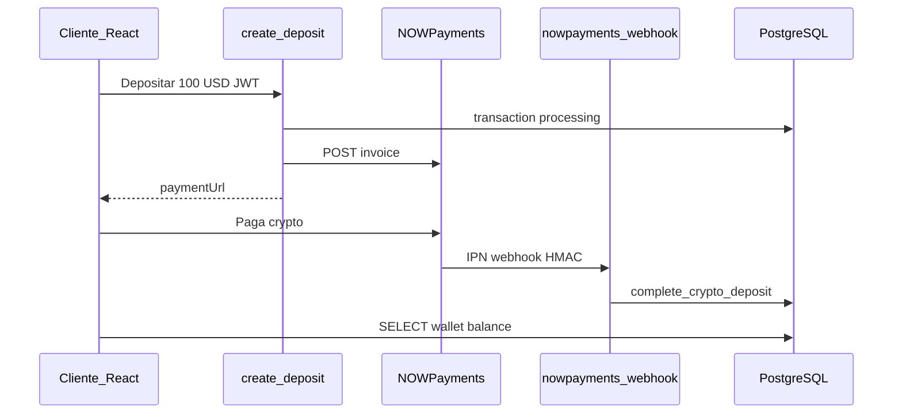

# Guía paso a paso — NOWPayments + InvestPRO

Guía operativa para activar depósitos crypto (NOWPayments), billetera en Supabase y aprobaciones del CHIEF.

---

## Mapa de documentación

| Documento | Para qué sirve |
|-----------|----------------|
| **Este archivo** (`GUIA_NOWPAYMENTS.md`) | Paso a paso completo — empieza aquí |
| [`supabase/PAYMENTS_DEPLOY.md`](../supabase/PAYMENTS_DEPLOY.md) | Referencia técnica deploy (comandos, URLs, SQL verify) |
| [`13_PASARELA_DE_PAGOS.md`](13_PASARELA_DE_PAGOS.md) | Arquitectura de negocio (crypto vs manual vs Stripe) |
| [`12_REQUISITOS_PARA_INICIAR.md`](12_REQUISITOS_PARA_INICIAR.md) | Checklist general de lanzamiento |

---

## Proyecto Supabase (InvesPro)

| Campo | Valor |
|-------|--------|
| **Project ref** | `rierlbcvpvfxkffxnyup` |
| **API URL** | `https://rierlbcvpvfxkffxnyup.supabase.co` |
| **Dashboard** | [Abrir proyecto](https://supabase.com/dashboard/project/rierlbcvpvfxkffxnyup) |
| **SQL Editor** | [Nueva query](https://supabase.com/dashboard/project/rierlbcvpvfxkffxnyup/sql/new) |
| **Edge Secrets** | [Configurar secrets](https://supabase.com/dashboard/project/rierlbcvpvfxkffxnyup/settings/functions) |

---

## Orden de trabajo (resumen)

| Fase | Qué haces | Tiempo |
|------|-----------|--------|
| **0** | SQL en Supabase (migraciones) | 30 min |
| **1** | Cuenta NOWPayments + API + USDT + IPN | 1–2 días |
| **2** | Secrets en Supabase | 15 min |
| **3** | Deploy Edge Functions | 15 min |
| **4** | `.env` frontend | 5 min |
| **5** | Prueba depósito $10 | 15 min |

---

## Arquitectura



**Regla de seguridad:** la API key de NOWPayments **nunca** va en el frontend (`VITE_*`). Solo en Supabase Edge Function secrets.

---

## FASE 0 — Base de datos Supabase

### 0.1 Ejecutar SQL (en orden)

En [SQL Editor](https://supabase.com/dashboard/project/rierlbcvpvfxkffxnyup/sql/new):

1. `supabase/schema.sql` (si no está aplicado)
2. `supabase/wallet_schema.sql`
3. `supabase/fix_rls.sql`
4. `supabase/migrations/202605200001_payment_rpcs.sql`
5. `supabase/migrations/202605200002_payment_rls.sql`

### 0.2 Verificar instalación

Ejecutar `supabase/verify_payments_setup.sql`.

Debe listar **7 RPCs** (`complete_crypto_deposit`, `create_deposit_transaction`, etc.) y columnas `invoice_id`, `payment_id` en `transactions`.

- [x] Migraciones aplicadas *(si ya ejecutaste los 5 scripts)*

---

## FASE 1 — Cuenta NOWPayments + API keys (1–2 días)

> **Prioridad:** Crítica  
> **Resultado:** API key, wallet USDT TRC20 e IPN secret listos para Supabase.

### Paso 1.1 — Registro

| # | Acción |
|---|--------|
| 1 | Ir a [https://nowpayments.io](https://nowpayments.io) |
| 2 | **Sign up** con email corporativo |
| 3 | Confirmar correo |
| 4 | Completar perfil del negocio si lo solicitan |

### Paso 1.2 — API Key

| # | Acción |
|---|--------|
| 1 | Dashboard → **API** / **Store Settings** → **API Keys** |
| 2 | **Create new API key** |
| 3 | Copiar y guardar en gestor de contraseñas |

**Uso posterior:** secret `NOWPAYMENTS_API_KEY` en Supabase (Fase 2).

### Paso 1.3 — Wallet de recepción USDT (TRC20)

| # | Acción |
|---|--------|
| 1 | **Store Settings** → **Payout wallets** |
| 2 | Agregar dirección **USDT (TRC20)** |
| 3 | Verificar dirección si NOWPayments lo pide |
| 4 | Marcar como wallet principal |
| 5 | Opcional: auto-conversión a USDT |

Ahí recibes el dinero cuando los clientes pagan.

### Paso 1.4 — IPN (webhook) + IPN Secret

Sin IPN, el saldo en InvestPRO **no se actualiza** automáticamente.

| # | Acción |
|---|--------|
| 1 | Dashboard → **Settings** → **IPN** |
| 2 | Activar IPN |
| 3 | **Callback URL** (copiar exacto): |

```
https://rierlbcvpvfxkffxnyup.supabase.co/functions/v1/nowpayments-webhook
```

| 4 | Guardar |
| 5 | Copiar **IPN Secret** |

**Uso posterior:** secret `NOWPAYMENTS_IPN_SECRET` en Supabase (Fase 2).

> La URL responde cuando la Edge Function `nowpayments-webhook` esté deployada (Fase 3).

### Paso 1.5 — Sandbox (recomendado)

- Activar **Sandbox** / test mode si existe
- Usar API key de sandbox en desarrollo
- Pasar a producción antes del lanzamiento real

### Checklist Fase 1

| Item | Listo |
|------|-------|
| Cuenta NOWPayments verificada | ☐ |
| API Key copiada | ☐ |
| Wallet USDT TRC20 configurada | ☐ |
| IPN URL configurada | ☐ |
| IPN Secret copiado | ☐ |

---

## FASE 2 — Secrets en Supabase (15 min)

1. Abrir [Edge Functions → Secrets](https://supabase.com/dashboard/project/rierlbcvpvfxkffxnyup/settings/functions)
2. En **Settings → API** copiar anon key y service_role key

| Secret (nombre exacto) | Valor |
|------------------------|--------|
| `SUPABASE_URL` | `https://rierlbcvpvfxkffxnyup.supabase.co` |
| `SUPABASE_ANON_KEY` | anon public |
| `SUPABASE_SERVICE_ROLE_KEY` | service_role *(nunca en frontend)* |
| `NOWPAYMENTS_API_KEY` | de Fase 1.2 |
| `NOWPAYMENTS_IPN_SECRET` | de Fase 1.4 |
| `APP_URL` | `http://localhost:5173` o tu dominio |

3. Guardar cada secret

### Checklist Fase 2

| Item | Listo |
|------|-------|
| 6 secrets configurados | ☐ |

---

## FASE 3 — Deploy Edge Functions (15 min)

PowerShell en la carpeta del proyecto:

```powershell
npx supabase login
npm run supabase:functions:deploy
```

Funciones deployadas:

| Función | URL |
|---------|-----|
| `create-deposit` | `https://rierlbcvpvfxkffxnyup.supabase.co/functions/v1/create-deposit` |
| `nowpayments-webhook` | `https://rierlbcvpvfxkffxnyup.supabase.co/functions/v1/nowpayments-webhook` |
| `approve-transaction` | `https://rierlbcvpvfxkffxnyup.supabase.co/functions/v1/approve-transaction` |

Comprobar en Dashboard → **Edge Functions** que las 3 aparecen.

### Errores CLI

| Error | Solución |
|-------|----------|
| `privileges` | `npx supabase login` con cuenta dueña del proyecto |
| `verify_jwt` config | Ya corregido en `supabase/config.toml` |
| Not logged in | Ejecutar login de nuevo |

### Checklist Fase 3

| Item | Listo |
|------|-------|
| `npx supabase login` OK | ☐ |
| 3 functions deployadas | ☐ |

---

## FASE 4 — Frontend `.env` (5 min)

Crear `.env` en la raíz del proyecto:

```env
VITE_SUPABASE_URL=https://rierlbcvpvfxkffxnyup.supabase.co
VITE_SUPABASE_ANON_KEY=eyJ...tu_anon_key...
VITE_APP_URL=http://localhost:5173
```

**No incluir** `NOWPAYMENTS_API_KEY`.

```powershell
npm run dev
```

### Checklist Fase 4

| Item | Listo |
|------|-------|
| `.env` creado y dev server reiniciado | ☐ |

---

## FASE 5 — Prueba end-to-end (15 min)

### 5.1 Login real

- Usuario en Supabase Auth (ej. `client@investpro.com`)
- Login email/contraseña en la app
- **No usar** solo simulación RBAC (no tiene JWT para Edge Functions)

### 5.2 Depósito crypto en la app

1. `/dashboard/account?tab=depositar`
2. Tab **Criptomonedas** → submodo **Pasarela** o **Depósito directo** (chip USDT/BTC/ETH)
3. Monto: `10` USD → pasarela redirige a NOWPayments; directo muestra dirección on-chain
4. Sin warning React en consola al cargar la página

### 5.3 Verificar en Supabase

**Table Editor → `transactions`:**

| Momento | `status` | Otros campos |
|---------|----------|----------------|
| Antes de pagar | `processing` | `gateway = nowpayments`, `external_url` |
| Después de pagar | `completed` | `payment_id` poblado |

**Table Editor → `wallets`:** `balance` aumentó (~$9.95 neto si fee 0.5%).

**Table Editor → `payment_events`:** `ipn_received`, `balance_credited`.

### 5.4 Depósito manual Perú (sin NOWPayments)

1. Cliente → Depositar → **Transferencia Perú** (4 pasos + voucher → bucket `deposit-receipts`)
2. Verificar `transactions.receipt_path`, `amount_pen_declared` poblados
3. CHIEF → **Validación de Depósitos** → Aprobar → `wallets.balance` aumenta

### Checklist E2E depósito (Mayo 2026)

| # | Prueba | OK |
|---|--------|-----|
| 1 | Cargar `?tab=depositar` sin error React | ☐ |
| 2 | Banner modo Demo/Real coherente | ☐ |
| 3 | Crypto pasarela $10+ (con API key) | ☐ |
| 4 | Crypto directo USDT → dirección visible | ☐ |
| 5 | Manual Perú + voucher → TX pending | ☐ |
| 6 | Sin API key → error claro; manual funciona | ☐ |
| 7 | `?deposit=success` → refresh balance | ☐ |

### Checklist Fase 5

| Item | Listo |
|------|-------|
| Depósito crypto probado | ☐ |
| `transactions` → `completed` | ☐ |
| `wallets.balance` actualizado | ☐ |
| Depósito manual + aprobación CHIEF probado | ☐ |

---

## FASE 6 — Troubleshooting

### Depositar falla en local (`FunctionsHttpError` / non-2xx)

1. [Edge Secrets](https://supabase.com/dashboard/project/rierlbcvpvfxkffxnyup/settings/functions): `NOWPAYMENTS_API_KEY`, `APP_URL`, `SUPABASE_*`
2. Deploy: `npx supabase functions deploy create-deposit`
3. Logs: Dashboard → Edge Functions → `create-deposit` → Logs (mensaje real: API key, RPC, NOWPayments)
4. **Transferencia Perú** no requiere NOWPayments — usar tab «Transferencia Perú» para probar sin pasarela

Mensajes UX en app (si falta API key): *«Pagos crypto no configurados… Usa transferencia bancaria»*.

### Botón "Pagar con Crypto" falla

| Causa | Revisar |
|-------|---------|
| Functions no deployadas | Edge Functions en dashboard |
| Secrets faltantes | Los 6 secrets de Fase 2 |
| Sin JWT | Login real, no RBAC simulado |
| RPC no existe | Fase 0 — migración `202605200001` |

### Pago hecho pero balance no sube

| Causa | Revisar |
|-------|---------|
| IPN URL incorrecta | Debe ser URL exacta de `nowpayments-webhook` |
| IPN secret mal copiado | `NOWPAYMENTS_IPN_SECRET` en Supabase |
| Webhook no deployado | Fase 3 |
| Firma HMAC inválida | Logs de `nowpayments-webhook` |

**Logs:** Dashboard → Edge Functions → `nowpayments-webhook` → Logs

---

## Checklist maestro producción

### Base de datos
- [x] SQL migraciones (Fase 0)
- [ ] `verify_payments_setup.sql` OK

### NOWPayments
- [ ] Cuenta + API key (Fase 1)
- [ ] Wallet USDT TRC20 (Fase 1)
- [ ] IPN URL + secret (Fase 1)

### Supabase
- [ ] Secrets (Fase 2)
- [ ] Edge Functions deploy (Fase 3)

### App
- [ ] `.env` frontend (Fase 4)
- [ ] Prueba E2E $10 (Fase 5)

---

## Referencia de código en el repo

| Archivo | Rol |
|---------|-----|
| `supabase/functions/create-deposit/` | Crea TX + invoice NOWPayments |
| `supabase/functions/nowpayments-webhook/` | IPN → acredita wallet |
| `supabase/functions/approve-transaction/` | CHIEF aprueba manual/retiros |
| `src/core/payments/payment.service.ts` | Frontend → Edge Functions |
| `src/features/client/tabs/DepositTab.tsx` | UI depósito unificada |
| `src/features/client/components/CryptoDepositSection.tsx` | Crypto pasarela + directo |
| `src/features/wallet/components/ManualDepositPeruFlow.tsx` | Transferencia Perú 4 pasos |
| `src/features/crm/pages/ChiefDashboard.tsx` | UI aprobación CHIEF |

---

## Flujos operativos

**Depósito crypto (automático):**
```
Cliente → Depositar → NOWPayments → paga → IPN → balance++
```

**Depósito manual:**
```
Cliente → Transferencia → CHIEF aprueba → balance++
```

**Retiro:**
```
Cliente solicita → saldo reservado → CHIEF aprueba/rechaza
```

> La tabla `deposits` (CRM legacy) sigue para FTDs de agentes. La billetera del cliente usa `transactions` + `wallets`.

---

*InvestPRO — Guía NOWPayments — Actualizado Mayo 2026*
