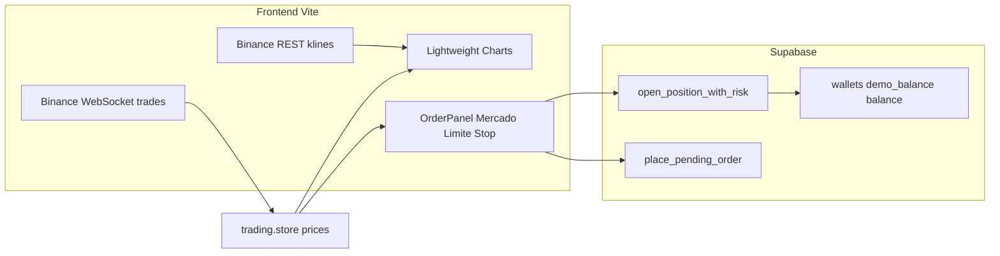

# Guía TradingView, datos de mercado y operativa completa — InvestPRO Terminal

> Referencia para `/dashboard/trade`, el enlace **Lightweight Charts™** de TradingView y la estrategia de precios/APIs para compra–venta fluida en demo y real.  
> Complementa: [`GUIA_TERMINAL_FORTADE.md`](GUIA_TERMINAL_FORTADE.md), [`USUARIOS_PRUEBA_INVESTPRO.md`](USUARIOS_PRUEBA_INVESTPRO.md).

---

## 1. ¿Por qué aparece TradingView al abrir el terminal?

El gráfico de InvestPRO usa la librería open source **[Lightweight Charts™](https://www.tradingview.com/lightweight-charts/)** (paquete npm `lightweight-charts`). TradingView muestra un enlace de atribución cuando detecta uso local:

`https://www.tradingview.com/?utm_medium=lwc-link&utm_campaign=lwc-chart&utm_source=localhost/dashboard/trade`

Eso **no significa** que el terminal esté conectado a la plataforma comercial TradingView.com ni a sus datos de acciones NYSE/NASDAQ. Es solo la **marca y licencia** de la librería de dibujo.

| Producto TradingView | Qué es | ¿InvestPRO hoy? |
|----------------------|--------|-----------------|
| **Lightweight Charts™** | Librería JS ~35 KB, velas, líneas; **sin** indicadores ni datos | **Sí** — `CandlestickChart.tsx` |
| **Advanced Charts** | Librería completa (indicadores, dibujos); licencia comercial | No |
| **Trading Platform** | Advanced + ejecución broker | No |
| **Widgets embebidos** | iframe con datos TV | No |
| **Suscripción TradingView.com** | Usuario final (alertas, ideas, pantallas) | No aplica al backend |

---

## 2. Arquitectura actual del terminal (Fortrade)



| Capa | Fuente | Coste directo |
|------|--------|---------------|
| Velas históricas | `https://api.binance.com/api/v3/klines` | **$0** (límites de rate) |
| Precio en vivo | `wss://stream.binance.com` combined `@trade` | **$0** |
| Ejecución / margen | RPCs Postgres (`202605290001`, `202605350001`) | Infra Supabase |
| Gráfico | Lightweight Charts™ | **$0** (Apache 2.0 + atribución) |

**Instrumentos live hoy** (`src/features/trading/config/instruments.ts`):

| UI | Símbolo Binance | Símbolo BD | Nota |
|----|-----------------|------------|------|
| BTC/USD | `BTCUSDT` | `BTC/USD` | Crypto spot proxy |
| ETH/USD | `ETHUSDT` | `ETH/USD` | Crypto spot proxy |
| EUR/USD | `EURUSDT` | `EUR/USD` | **No es forex interbancario**; es par crypto |
| Oro XAU/USD | `XAUUSDT` | `XAU/USD` | Tokenizado en Binance, no COMEX |

**Próximamente en catálogo:** S&P 500, Nasdaq 100, USD/PEN — requieren **otro proveedor de datos** (ver sección 6).

---

## 3. Reglas de margen y “precios que debes usar”

Fórmula del motor (apalancamiento por defecto **100x**, wallet `leverage`):

```text
Margen requerido (USD) = (volumen × precio) / apalancamiento
```

Cuenta **demo** arranca con **$10,000** (`demo_balance`). Para que una operación sea **completa** (abrir + cerrar con PnL visible):

1. **Mercado en vivo** — badge WS `live` (si no, la boleta bloquea: *“Esperando cotización en vivo…”*).
2. **Volumen** — presets UI: `0.01`, `0.1`, `0.5`, `1` (mínimo técnico BD: `volume > 0`).
3. **Modo demo** — usar switch **Demo** en la barra de métricas.
4. **Cerrar** — tab **Abiertas** → cerrar posición (liquida PnL en el libro activo).

### 3.1 Escenarios recomendados por instrumento (demo $10,000 @ 100x)

Precios de referencia orientativos (mercado mayo 2026 — **usar siempre el precio en pantalla**, no estos números fijos).

| Instrumento | Precio ref. aprox. | Volumen recomendado | Margen aprox. | Compra (BUY) | Venta / cierre |
|-------------|-------------------|---------------------|---------------|--------------|----------------|
| **BTC/USD** | $65,000 – $72,000 | **0.01** | ~$6.5 – $7.2 | Mercado **COMPRAR** al Ask | **Cerrar** posición o Mercado **VENDER** (abre SHORT si el motor lo permite; hoy el flujo principal es BUY + cierre) |
| **BTC/USD** | idem | **0.1** | ~$65 – $72 | Prueba PnL visible | Cerrar con movimiento ≥ $100 en precio → PnL ~$10 en 0.1 lotes |
| **ETH/USD** | $2,100 – $2,500 | **0.1** | ~$2.1 – $2.5 | Mercado COMPRAR | Cerrar tras +$20 en ETH → PnL ~$2 |
| **ETH/USD** | idem | **1** | ~$21 – $25 | Solo si margen libre lo permite | — |
| **EUR/USD** (EURUSDT) | $1.05 – $1.15 | **0.5** | ~$0.005 – $0.006 | Mercado COMPRAR | Cerrar; movimientos pequeños en PnL |
| **XAU/USD** | $4,400 – $4,700 | **0.01** | ~$0.44 – $0.47 | Mercado COMPRAR | Cerrar; SL/TP en puntos (ej. SL −$30, TP +$50 del precio oro) |

**Regla práctica:** con $10,000 demo, mantener **margen usado total &lt; 20% equity** en pruebas (varias posiciones pequeñas).

### 3.2 Órdenes Límite y Stop (compra/venta “completa” pendiente)

Lógica en `pending-order.utils.ts`:

| Tipo | Lado | Se ejecuta cuando |
|------|------|-------------------|
| **LIMIT** | BUY | precio mercado **≤** trigger (compras más barato) |
| **LIMIT** | SELL | precio mercado **≥** trigger |
| **STOP** | BUY | precio mercado **≥** trigger (ruptura alcista) |
| **STOP** | SELL | precio mercado **≤** trigger |

**Ejemplo BTC** con precio en pantalla **$68,000**:

| Objetivo | Tipo | Lado | Trigger sugerido | Cómo probar |
|----------|------|------|------------------|-------------|
| Compra en dip | LIMIT | BUY | **$67,500** | Esperar tick ≤ 67,500 o acercar mercado |
| Compra en ruptura | STOP | BUY | **$68,500** | Cuando precio suba a 68,500 |
| Toma de ganancia corta | LIMIT | SELL | **$69,000** | Con posición LONG previa, o como pendiente de entrada short si el producto lo soporta |

**Truco UI:** clic en el gráfico fija precio en tabs **Límite** / **Stop** (línea “Precio orden”).

### 3.3 Bid / Ask simulado en boleta

La UI muestra:

- **Bid** ≈ precio × 0.9999  
- **Ask** ≈ precio × 1.0001  

No es spread institucional; para demo basta. Si quieres realismo estilo broker, añadir `spreadHint` del instrumento (`instruments.ts`) al cálculo.

---

## 4. Flujo E2E “compra y venta completa” (checklist QA)

### Demo — Mercado (5 minutos)

1. Login `client@investpro.com` → `/dashboard/trade`.
2. Confirmar **Demo** y balance ~$10,000.
3. Instrumento **BTC/USD** — esperar precio verde y WS live.
4. Volumen **0.01** → **COMPRAR** → posición en **Abiertas**.
5. Ver línea verde de entrada en el gráfico.
6. **Cerrar** posición → PnL en historial / equity actualizado.
7. **Reiniciar demo** (banner) si necesitas estado limpio.

### Demo — Límite + Stop

1. Tab **Límite** → BUY trigger **−0.5%** bajo precio actual (clic en vela baja).
2. Tab **Pendientes** — estado `PENDING`.
3. Cuando el mercado toque el nivel (watcher cada 1.5 s), pasa a `FILLED` y aparece posición.
4. Repetir con **Stop** BUY **+0.3%** sobre precio.

### Cuenta real

1. Switch **Real** — sin depósito, botones bloqueados + CTA **Depositar**.
2. Tras acreditar depósito (manual Perú / crypto), repetir flujo con volúmenes menores.

---

## 5. TradingView: opciones si quieres “verse como TradingView”

### 5.1 Mantener Lightweight Charts (recomendado — coste $0)

**Ventajas:** ya integrado, rápido, control total del datafeed Binance.  
**Obligaciones legales:**

- Conservar atribución / enlace a TradingView (footer o tooltip “Charts by TradingView”).
- Licencia [Apache 2.0](https://www.apache.org/licenses/LICENSE-2.0).

**Mejoras UX estilo TV (sin cambiar librería):**

| Elemento | Recomendación |
|----------|----------------|
| Colores | Verde `#10b981` / rojo `#ef4444` (ya en chart) — alinear con `bolt-theme` |
| Timeframes | 15m / 1h / 1d en toolbar (ya soportados) |
| Crosshair | Modo magnético + OHLC en tooltip flotante |
| Volumen | Serie histograma bajo velas (segunda serie LWC) |
| Indicadores | SMA/EMA vía `useIndicatorWorker` o overlay manual — TV Lightweight **no** trae RSI/MACD built-in |
| Watchlist | Columnas: símbolo, último, % cambio 24h (REST Binance `ticker/24hr`) |
| Layout | Watchlist izquierda · chart centro · boleta derecha · panel inferior posiciones (layout actual Fortrade) |

### 5.2 Advanced Charts / Trading Platform (empresa)

- Solicitud comercial en [TradingView Charting Library](https://www.tradingview.com/free-charting-libraries/).
- **No hay precio público** — presupuesto anual según dominio, MAU y datos.
- Tú implementas **datafeed** + **Broker API**; TradingView no incluye cotizaciones.
- Indicadores y dibujos profesionales; peso y complejidad mayores.
- **No disponible** para proyectos personales/hobby según sus términos.

### 5.3 Widgets TradingView (rápido, menos control)

- Embed iframe con símbolos `NASDAQ:AAPL`, `BINANCE:BTCUSDT`, etc.
- Datos incluidos en el widget (según plan del visitante en TV).
- Menos integración con tu motor Supabase de órdenes.
- Útil en **landing educativa**, no en terminal de ejecución propia.

### 5.4 Suscripciones TradingView.com (usuario final)

Planes orientativos en [tradingview.com/pricing](https://www.tradingview.com/pricing/) (USD/mes, promociones variables):

| Plan | Precio ref. | Para quién |
|------|-------------|------------|
| Basic | $0 | Exploración |
| Essential | ~$12.95 | Más indicadores y alertas |
| Plus | ~$29.95 | Intradía serio |
| Premium | ~$59.95 | Múltiples marcos temporales avanzados |
| Ultimate | ~$199.95 | Profesional / más pantallas |

**Importante:** esto es para **traders que usan el sitio TradingView**, no sustituye licencia de librería embebida en InvestPRO.  
Datos bursátiles en tiempo real (NYSE, NASDAQ) en TV suelen ser **add-ons** de pago aparte.

---

## 6. APIs de mercado recomendadas y gastos estimados

### 6.1 Stack actual (mantener para crypto + oro tokenizado)

| API | Uso | Coste mensual estimado | Límites |
|-----|-----|------------------------|---------|
| **Binance Spot REST** | Klines, tickers | **$0** | ~1200 req/min IP; cachear |
| **Binance WebSocket** | Trades en vivo | **$0** | Reconexión exponencial |
| **Supabase** | Auth, posiciones, wallet | Plan Free → Pro **$25+** | Ver facturación proyecto |

### 6.2 Si añades acciones / índices reales (S&P 500, Nasdaq, acciones US)

Binance **no** cotiza `AAPL` ni `SPX` como CFD regulado. Opciones:

| Proveedor | Datos | Precio orientativo | Notas |
|-----------|-------|-------------------|-------|
| **Polygon.io** | US stocks, índices, forex | Free tier limitado; Starter **~$29–199/mes** | Muy usado en fintech |
| **Finnhub** | Acciones, forex, crypto | Free 60 calls/min; premium **~$50+/mes** | Fácil REST |
| **Twelve Data** | Acciones, forex, commodities | Free 8 req/min; Grow **~$29+/mes** | Buen equilibrio |
| **Alpha Vantage** | Acciones, FX | Free 25 req/día; premium **~$50+/mes** | Lento en free |
| **IEX Cloud** | US equities | Planes desde **~$9/mes** | Datos US |
| **OANDA / FXCM** | Forex real | Cuenta broker | Para EUR/USD real Perú |
| **MetaTrader bridge** | CFD retail | Licencia broker | Complejidad alta |

**Recomendación InvestPRO fase 2:**

1. **Corto plazo demo índices:** continuar crypto + XAUUSDT + mostrar SP500/Nasdaq como `coming_soon`.
2. **MVP acciones US:** Polygon o Twelve Data → Edge Function que normalice OHLC al formato LWC.
3. **Perú USD/PEN:** tipo de cambio SUNAT / API BCRP o proveedor forex; no usar `EURUSDT` como PEN.

### 6.3 Arquitectura segura de APIs (obligatorio)

```text
Navegador → Solo VITE_SUPABASE_URL + anon key
         → Supabase Edge Function / RPC
         → Proveedor de mercado (API key en secret)
```

**Nunca** poner API keys de Polygon/Twelve/Binance en el frontend.  
Patrón ya usado en NOWPayments y Twilio (`supabase/functions`).

### 6.4 Coste infraestructura total (orden de magnitud)

| Concepto | Dev / demo | Producción pequeña (500 MAU) |
|----------|------------|------------------------------|
| Supabase Pro | $0–25 | $25–75 |
| Vercel/hosting front | $0 | $20 |
| Binance datos | $0 | $0 |
| Proveedor acciones (opcional) | $0 | $50–200 |
| TradingView Advanced (opcional) | $0 | **Presupuesto custom** (suele ser $$$) |
| Resend email | $0 | $20 |
| Twilio VoIP (si CRM llamadas) | — | Uso variable |
| **Total sin TV Advanced** | **~$0–50** | **~$115–400/mes** |

---

## 7. Acciones US: precios de ejemplo para prueba de compra–venta

Cuando integres datos reales (símbolo `NASDAQ:NVDA` → ticker `NVDA`), usa **precio de mercado en tiempo real** y estas reglas:

| Acción | Rango precio 2026 ref. | Volumen demo (acciones) | Margen @ 20x (ejemplo) |
|--------|------------------------|-------------------------|-------------------------|
| **AAPL** | $180 – $220 | 1 – 10 | (10 × 200) / 20 = **$100** |
| **NVDA** | $90 – $140 | 1 – 5 | (5 × 120) / 20 = **$30** |
| **TSLA** | $250 – $350 | 1 – 5 | (5 × 300) / 20 = **$75** |
| **SPY (S&P ETF)** | $500 – $600 | 1 – 2 | Bajo riesgo para tutoriales |

**Compra completa:** MARKET BUY → posición OPEN → MARKET CLOSE.  
**Límite:** BUY LIMIT por debajo del last; **Stop:** BUY STOP por encima (ruptura).

> Hoy InvestPRO **no ejecuta** estas acciones hasta conectar datafeed + símbolos en `instruments.ts` con `availability: 'live'`.

---

## 8. Recomendaciones UI “que se vea muy bien”

| Área | Acción |
|------|--------|
| **Gráfico** | Volumen debajo; escala % en watchlist; botón pantalla completa |
| **Boleta** | Spread visual Bid/Ask más ancho en oro; slider volumen |
| **Estados** | Skeleton mientras `loading` klines; toast en error WS |
| **Modo demo** | Banner amarillo persistente “Fondos virtuales” |
| **Modo real** | Badge rojo + enlace KYC antes de operar |
| **Móvil** | Sheet “Operar” con tabs sticky (ya en Fortrade) |
| **Legal** | Disclaimer “CFD simulado / riesgo de pérdida” bajo botón COMPRAR |
| **Atribución** | Footer: “Gráficos powered by TradingView Lightweight Charts™” |

Paleta sugerida (alineada a TV claro):

- Fondo chart: `#ffffff`
- Grid: `#e8ebe6`
- Texto: `#454745`
- Primary brand: tokens `bolt-theme` / `invest-theme`

---

## 9. Roadmap técnico sugerido

| Fase | Entregable | Esfuerzo |
|------|------------|----------|
| **A** | Documentar y fijar escenarios demo (esta guía) | Hecho |
| **B** | Volumen histogram + % 24h en watchlist | 1–2 días |
| **C** | Edge `market-proxy` + cache klines | 2–3 días |
| **D** | Polygon/Twelve para 3 índices US en demo | 1 semana |
| **E** | USD/PEN tipo cambio Perú | 3–5 días |
| **F** | Valorar Advanced Charts solo si clientes exigen dibujos TV | Comercial |

---

## 10. Riesgos legales y de producto (Perú)

- Los pares vía Binance son **crypto**, no acciones en bolsa local.
- Copy en UI debe decir **“CFD / contrato sintético — no es activo subyacente en MV”** donde aplique.
- Datos con retraso: indicar **“15 min delay”** si usas tier free de acciones.
- TradingView: cumplir [Terms of Use](https://www.tradingview.com/terms-of-use/) y atribución LWC.
- No prometer “mismo dato que TradingView.com” si el feed es Binance.

---

## 11. Enlaces oficiales

| Recurso | URL |
|---------|-----|
| TradingView (plataforma) | https://www.tradingview.com/ |
| Lightweight Charts™ | https://www.tradingview.com/lightweight-charts/ |
| Comparativa librerías | https://www.tradingview.com/free-charting-libraries/ |
| Docs Advanced Charts | https://www.tradingview.com/charting-library-docs/latest/product-comparison |
| Precios suscripción TV | https://www.tradingview.com/pricing/ |
| Binance API | https://binance-docs.github.io/apidocs/spot/en/ |
| Terminal InvestPRO | `/dashboard/trade` |

---

## 12. Resumen ejecutivo

1. El enlace TradingView en localhost es **atribución de Lightweight Charts**, no integración con la plataforma de suscripción.  
2. InvestPRO ya opera **compra–venta completa** en **BTC, ETH, EURUSDT, XAUUSDT** con precios Binance en vivo y margen 100x en demo.  
3. Usa volúmenes **0.01–0.1** en BTC/ETH para pruebas con $10,000 demo.  
4. **Límite/Stop** usan `trigger_price` respecto al último tick WS.  
5. **Acciones e índices US** requieren API de pago (Polygon/Twelve/etc.) — presupuesto ~$50–200/mes además de infra.  
6. **TradingView Advanced** es opcional y comercial; para la mayoría de brokers retail, **LWC + Binance + tu motor Supabase** es la opción más rentable.

*Última revisión: mayo 2026 — revisar precios de proveedores antes de contratar.*
