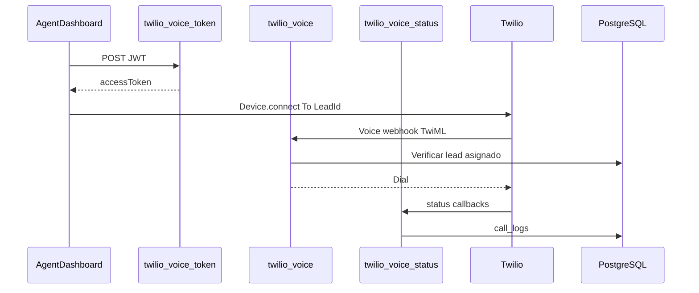

# Guía paso a paso — Twilio VoIP + InvestPRO

Activar llamadas salientes reales desde el **Auto-Dialer** del agente (WebRTC + Twilio Programmable Voice).

---

## Mapa de documentación

| Documento | Para qué sirve |
|-----------|----------------|
| **Este archivo** (`GUIA_TWILIO_VOIP.md`) | Paso a paso completo — empieza aquí |
| [`10_COSTOS_OPERATIVOS_TECNICOS.md`](10_COSTOS_OPERATIVOS_TECNICOS.md) | Costos estimados del dialer |
| [`14_ROL_AGENT_CLOSER.md`](14_ROL_AGENT_CLOSER.md) | Flujo operativo del agente |
| [`12_REQUISITOS_PARA_INICIAR.md`](12_REQUISITOS_PARA_INICIAR.md) | Checklist de lanzamiento |

---

## Proyecto Supabase (InvestPRO)

| Campo | Valor |
|-------|--------|
| **Project ref** | `rierlbcvpvfxkffxnyup` |
| **API URL** | `https://rierlbcvpvfxkffxnyup.supabase.co` |
| **Edge Secrets** | [Configurar secrets](https://supabase.com/dashboard/project/rierlbcvpvfxkffxnyup/settings/functions) |

---

## Orden de trabajo (resumen)

| Fase | Qué haces | Tiempo |
|------|-----------|--------|
| **0** | SQL `call_logs` en Supabase | 15 min |
| **1** | Cuenta Twilio + número + API Key + TwiML App | 1–2 h |
| **2** | Secrets en Supabase | 15 min |
| **3** | Deploy Edge Functions | 15 min |
| **4** | Prueba E2E desde dashboard agente | 30 min |
| **5** | Troubleshooting | según caso |

---

## Arquitectura



**Seguridad:** `TWILIO_AUTH_TOKEN` y API Key **nunca** en `VITE_*`. Solo secrets de Edge Functions.

**MVP incluido en código:**
- Llamadas **salientes** con botón **Llamar** (manual)
- Sin grabación
- Tabla `call_logs` + RLS

---

## FASE 0 — Base de datos

En [SQL Editor](https://supabase.com/dashboard/project/rierlbcvpvfxkffxnyup/sql/new), ejecutar:

```
supabase/migrations/202605260001_twilio_calls.sql
```

Verificar:

```sql
SELECT COUNT(*) FROM information_schema.tables
WHERE table_schema = 'public' AND table_name = 'call_logs';
```

---

## FASE 1 — Cuenta Twilio

1. Crear cuenta en [twilio.com](https://www.twilio.com).
2. **Phone Numbers → Buy a number** con prefijo **+51 (Perú)** para callback a leads locales. Horario operativo: Lima UTC-5.
3. **Account → API keys & tokens → Create API Key** (tipo Standard). Guardar:
   - API Key SID (`SK...`)
   - API Key Secret (solo se muestra una vez)
4. **Explore → Voice → Manage → TwiML Apps → Create**:
   - **Voice Request URL:** `https://rierlbcvpvfxkffxnyup.supabase.co/functions/v1/twilio-voice`
   - **Voice Method:** POST
   - Guardar **TwiML App SID** (`AP...`)
5. Anotar también:
   - **Account SID** (`AC...`)
   - **Auth Token** (primario)
   - **Número comprado** en E.164 (`+1...`)

> El **Status Callback** de cada llamada se envía desde el TwiML `<Dial statusCallback="...">` hacia `twilio-voice-status` (no hace falta configurarlo en la TwiML App para salientes).

---

## FASE 2 — Secrets en Supabase

En [Edge Function Secrets](https://supabase.com/dashboard/project/rierlbcvpvfxkffxnyup/settings/functions):

| Secret | Ejemplo |
|--------|---------|
| `TWILIO_ACCOUNT_SID` | `ACxxxxxxxx` |
| `TWILIO_AUTH_TOKEN` | token primario |
| `TWILIO_API_KEY_SID` | `SKxxxxxxxx` |
| `TWILIO_API_KEY_SECRET` | secret de la API key |
| `TWILIO_TWIML_APP_SID` | `APxxxxxxxx` |
| `TWILIO_PHONE_NUMBER` | `+15551234567` |

Los secrets `SUPABASE_URL`, `SUPABASE_ANON_KEY` y `SUPABASE_SERVICE_ROLE_KEY` ya deben existir para otras funciones.

---

## FASE 3 — Deploy Edge Functions

Desde la raíz del repo:

```bash
npm run supabase:functions:deploy
```

O individualmente:

```bash
supabase functions deploy twilio-voice-token --project-ref rierlbcvpvfxkffxnyup
supabase functions deploy twilio-voice --project-ref rierlbcvpvfxkffxnyup
supabase functions deploy twilio-voice-status --project-ref rierlbcvpvfxkffxnyup
```

**Desarrollo local:**

```bash
# supabase/.env.local con los TWILIO_* anteriores
npm run supabase:functions:serve
```

---

## FASE 4 — Prueba E2E

1. Aplicar migración SQL (Fase 0).
2. Login real como agente (`agent@investpro.com` o usuario AGENT con leads asignados).
3. Ir a **Dashboard Agente → Auto-Dialer** (`/dashboard/agent?tab=dialer`).
4. Esperar badge **Listo para llamar** (permite micrófono en el navegador).
5. Con un lead que tenga teléfono válido (E.164), pulsar **Llamar**.
6. Verificar en Supabase:

```sql
SELECT * FROM public.call_logs ORDER BY started_at DESC LIMIT 5;
```

---

## FASE 5 — Troubleshooting

| Síntoma | Causa probable | Solución |
|---------|----------------|----------|
| `Missing env: TWILIO_*` | Secrets no configurados | Fase 2 |
| `Invalid Twilio signature` | URL pública distinta a la configurada | Usar URL exacta de Supabase en TwiML App |
| Dialer no listo / error token | Sesión inválida o rol no operativo | Login AGENT+ |
| Teléfono inválido | Formato sin país | Revisar `country` del lead (+57, +52…) |
| Sin audio | Micrófono bloqueado | HTTPS + permiso micrófono en Chrome |
| Llamada rechazada en TwiML | Lead no asignado al agente | `assigned_to` debe ser `auth.uid()` |

---

## Archivos en el repo

| Ruta | Rol |
|------|-----|
| `supabase/migrations/202605260001_twilio_calls.sql` | Tabla + RLS |
| `supabase/functions/twilio-voice-token/` | Access Token JWT |
| `supabase/functions/twilio-voice/` | TwiML outbound |
| `supabase/functions/twilio-voice-status/` | Webhook estados |
| `src/features/crm/hooks/useTwilioDialer.ts` | SDK en navegador |
| `src/features/crm/pages/AgentDashboard.tsx` | UI Llamar / Colgar |

---

*InvestPRO — Dialer Twilio MVP — Mayo 2026*
