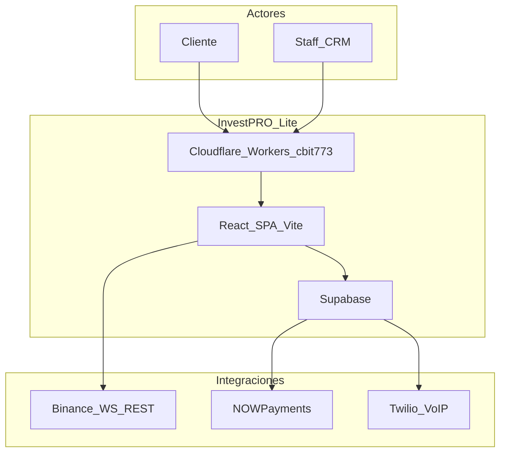

# Arquitectura InvestPRO Lite

> **Producto:** InvestPRO Lite  
> **Versión doc:** 1.0 — junio 2026  
> **Repo:** `https://github.com/cbit773-hash/samuelbit`  
> **Producción:** `https://cbit773.cbit773.workers.dev`  
> **Backend:** Supabase `rierlbcvpvfxkffxnyup`

Documento maestro de arquitectura para el despliegue **lite**: terminal web, wallet, CRM jerárquico básico (HEAD), auth RBAC y treasury manual/crypto.

**Estado operativo vivo:** [operations/ESTADO_DESARROLLO.md](../operations/ESTADO_DESARROLLO.md)

---

## 1. Qué es InvestPRO Lite

Plataforma web de broker / trading CFD orientada a **Latinoamérica (Perú-first)**. Integra en un solo SPA:

| Mundo | Rutas | Usuarios |
|-------|-------|----------|
| Público | `/`, `/registro`, `/mercados`, `/legal/*` | Visitantes, leads |
| Privado | `/dashboard/*` | Clientes y staff de ventas |

**Modelo de contraparte:** B-Book simulado — el broker es contraparte; no hay envío a mercado externo en MVP.

---

## 2. Diagrama de contexto

---

## 3. Stack (verificado en `package.json`)

| Capa | Tecnología | Versión |
|------|------------|---------|
| UI | React | 19 |
| Build | Vite | 8 |
| Lenguaje | TypeScript | 6 |
| Estilos | Tailwind CSS | 3.4 |
| Router | react-router-dom | 7 |
| Estado cliente | Zustand | 5 |
| Server state | ClientDataContext + servicios Supabase | — |
| Charts | lightweight-charts | 4 |
| Backend | Supabase (Postgres, Auth, Storage, Edge) | — |
| Hosting prod | Cloudflare Workers (`wrangler`) | — |

---

## 4. Bounded contexts (lite)

| Dominio | `src/features/` | Persistencia |
|---------|-----------------|--------------|
| Auth | `auth/` | Supabase Auth + `profiles` |
| Landing / captación | `landing/` | `leads`, `web_leads` |
| Cliente / wallet | `client/`, `wallet/` | `wallets`, `transactions` |
| Trading | `trading/` | `positions`, `orders` |
| CRM staff | `crm/` | `leads`, `teams`, `calls` |
| Legal | `legal/` | estático + T&C |
| KYC | `kyc/` | Storage + `profiles` |

Mapa de carpetas: [ESTRUCTURA_PROYECTO.md](../ESTRUCTURA_PROYECTO.md).

---

## 5. Backend Supabase (lite)

### Migración núcleo

- `20260629100000_investpro_lite_core.sql` — schema lite en producción
- Migraciones complementarias: `202605360002`, `202605370001`, y serie `20260526*`–`20260535*`

Detalle ER y RLS: [06_DATABASE_ARCHITECTURE.md](./06_DATABASE_ARCHITECTURE.md).

### Edge Functions desplegadas (8)

| Función | Rol |
|---------|-----|
| `approve-transaction` | Aprobación CHIEF de depósitos/retiros |
| `binance-market-data` | Proxy REST klines (prod) |
| `evaluate-position-brackets` | SL/TP server-side |
| `create-deposit-for-client` | Crear depósito |
| `process-web-lead` | Onboarding lead web |
| `twilio-voice-token` | Token dialer |
| `twilio-voice` | TwiML llamadas |
| `twilio-voice-status` | Callback estado llamada |

Código: `supabase/functions/`.

---

## 6. RBAC (7 roles)

Jerarquía: `HEAD` → `CHIEF` → `MANAGER` → `FLOOR_MANAGER` → `TEAM_LEADER` → `AGENT` → `CLIENT`

- Matriz general: [roles/08_ROLES_Y_FUNCIONES.md](../roles/08_ROLES_Y_FUNCIONES.md)
- Rutas por rol: `src/shared/layout/role-navigation.config.ts`

---

## 7. Flujos críticos (lite)

### Registro cliente

`/registro` → Supabase Auth → RPC `complete_client_onboarding` → wallet demo/live.

Guía: [guides/GUIA_REGISTRO_AUTH.md](../guides/GUIA_REGISTRO_AUTH.md).

### Depósito manual (Perú)

Cliente sube comprobante → transacción `pending` → CHIEF aprueba vía `approve-transaction`.

Guías: [guides/GUIA_PERU_PAGOS.md](../guides/GUIA_PERU_PAGOS.md).

### Trading live

`/dashboard/trade` → Binance WS + posiciones en BD → margin guards en cliente + brackets Edge.

Guía: [guides/GUIA_TRADINGVIEW_TERMINAL_MERCADO.md](../guides/GUIA_TRADINGVIEW_TERMINAL_MERCADO.md).

---

## 8. Design system

Tema **oscuro institucional + acento lima** (`#9fe870`):

| Archivo | Rol |
|---------|-----|
| `public/design/variables.css` | Tokens CSS |
| `src/styles/invest-semantic.css` | Semántica por superficie |
| `src/shared/theme/invest-theme.ts` | Objeto TS |

Detalle: [design/INVESTPRO_DESIGN_SYSTEM.md](../design/INVESTPRO_DESIGN_SYSTEM.md).

---

## 9. Seguridad

- RLS fail-closed en tablas operativas
- JWT Supabase en cliente; service role solo en Edge Functions
- `npm run test:rls` — verificación RLS

Detalle: [07_SECURITY_INFRASTRUCTURE.md](./07_SECURITY_INFRASTRUCTURE.md).

---

## 10. DevOps lite

Scripts y URLs: [operations/DEVOPS.md](../operations/DEVOPS.md).

Decisiones arquitectónicas: [ADRS.md](./ADRS.md).

---

## Documentación relacionada

| Documento | Contenido |
|-----------|-----------|
| [BRIEF_INVESTPRO_LITE.md](../BRIEF_INVESTPRO_LITE.md) | Resumen ejecutivo |
| [operations/ESTADO_DESARROLLO.md](../operations/ESTADO_DESARROLLO.md) | Snapshot prod |
| [operations/04_IMPLEMENTATION_ROADMAP.md](../operations/04_IMPLEMENTATION_ROADMAP.md) | Roadmap vs código |
| [README.md](../README.md) | Índice completo |
